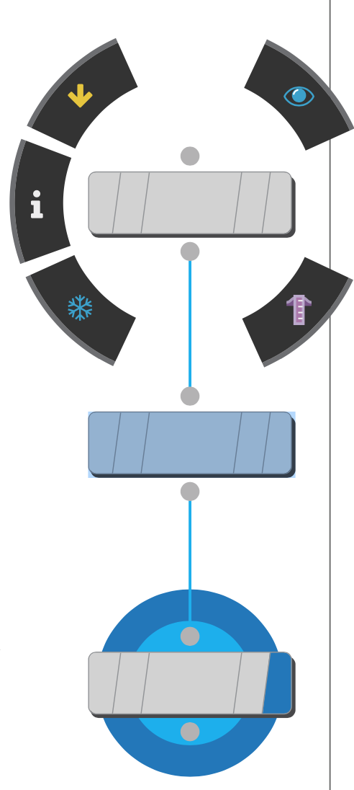

==============================
概览
==============================

在我们创建3D动画、电影特效、TV、游戏视频或者VR时，你需要把技术与创造性很好的结合。Houdini 就是将这些领域融合在一起的完美工具，能够帮助您探索、创建和完善您的项目（从概念到最终签核）。

虽然 Houdini 拥有多种专为生成 CG 内容而设计的工具，但其 **基于节点的工作流程（node-based procedural workflow）** 使其与众不同。 这种方法使您可以更轻松地 **创建直接镜头(create directable shots)**、 **探索多次迭代(multiple iterations)** 并 **按时完成任务(hit deadlines)**。 当您学习 Houdini 时，了解如何使用这些节点和网络对于您的成功非常重要。

**将学到什么**

本章节主要讲述 Houdini 大概有哪些内容，将帮助您熟悉重要的概念和创作思路。 虽然有些内容讲的比较宽泛，但这些将在您学习后面的基础教程并积累知识时起到重要的串联作用。

.. toctree::
    :caption: 本章节目录

    learning-houdini