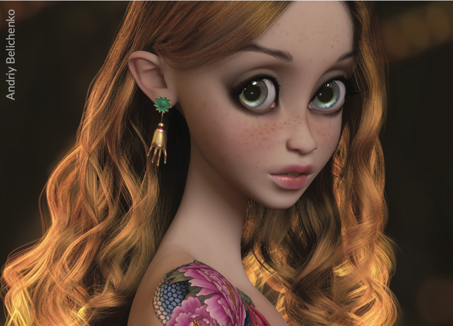

===============================================
学习Houdini
===============================================

Houdini 是一款计算机图形 (CG) 应用程序，可用于建模、制作动画、渲染和模拟。 在学习 Houdini 的过程中，您将探索管理创意过程的新方法，其中涉及节点、网络和资产的交互操作。

Houdini 中的一切都是程序化的，这意味着建模、角色绑定、灯光、渲染和视觉效果都受益于基于节点的工作流程，艺术家可以在其中构建节点网络来管理完成创意任务所需的所有步骤。 然后网络可以与其他网络“对话”以创建更复杂的系统。

**步入程序化**

在Houdini中，您执行的每个操作都存储为节点。 然后，这些节点被“连接”到网络中，网络定义了一个“配方”，可以对其进行调整以定义可重复的结果，其中每次迭代都可以生成独特的结果。 节点以属性的形式在链上传递重要信息的能力，有助于赋予 Houdini 程序性。

**以视觉特效闻名**

视觉特效师在习惯上更倾向于使用 Houdini，因为这种程序化的工作流程非常适合处理粒子和动态。 通常，视觉效果旨在对镜头中发生的动作做出反应，而程序解决方案可以“自动化”这些反应。 因此，Houdini 为从业人员提供了更高水平的生产力和更多对创作过程的控制。

.. image:: ../../_static/images/vfx.png
    :alt: 特效

Houdini 还能够处理大型数据集，随着视觉效果变得越来越复杂，许多层（例如刚体破坏、流体和粒子）都相互作用以实现最终结果，能够处理大型数据变得至关重要。

**程序化构建**

对于动态图形项目，程序化能够实现许多令人惊叹的视觉效果。 这些特殊效果通常是在节点上的设置动画参数或添加干扰，从而呈现出在现实中意想不到而有趣的效果。

.. image:: ../../_static/images/motion-project.png
    :alt: 动态图形项目

**更广泛的CG产品线**

除了视觉特效和动态图形之外，Houdini 还拥有适用于从建模到渲染到角色工作和游戏开发的管道等所有方面的基础工具。 它的程序工作流程在您创建所有 CG 内容时为您提供支持。 在此过程中，您将受益于探索「多次迭代」并深入生产的能力。

虽然节点是 Houdini 的独特之处，并拥有强大的功能，但在 Houdini 构建网络时，还有许多视口和架子工具可用于交互工作。

**直接修改节点并影响最终结果**

您能够在生产中进行深入编辑的原因，是对 Houdini 节点上的参数所做的更改将直接通过网络级联以更新至最终结果。 这种直接的修改影响在整个创作过程中得到保留，并可用于最终结果，而这在传统 CG 流程中成本太高。