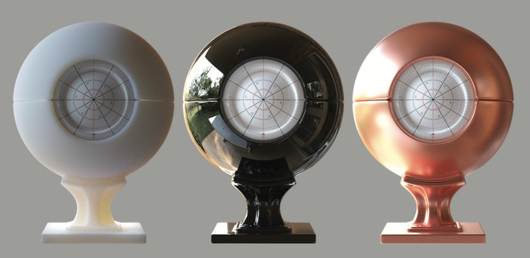
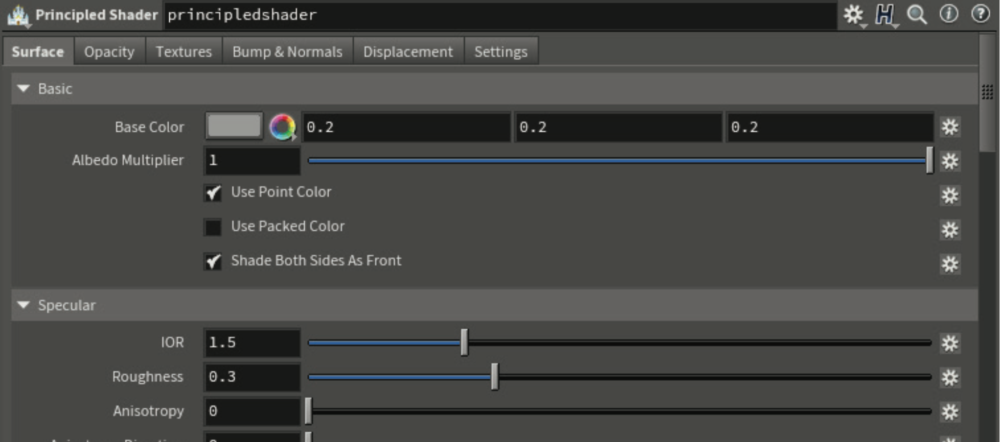
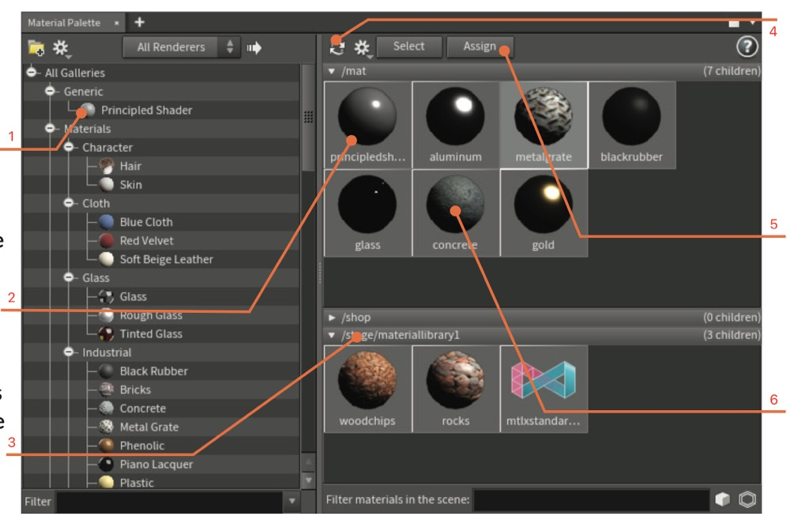
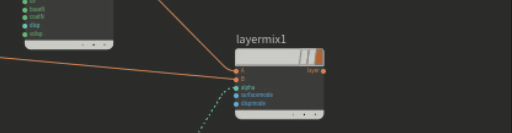
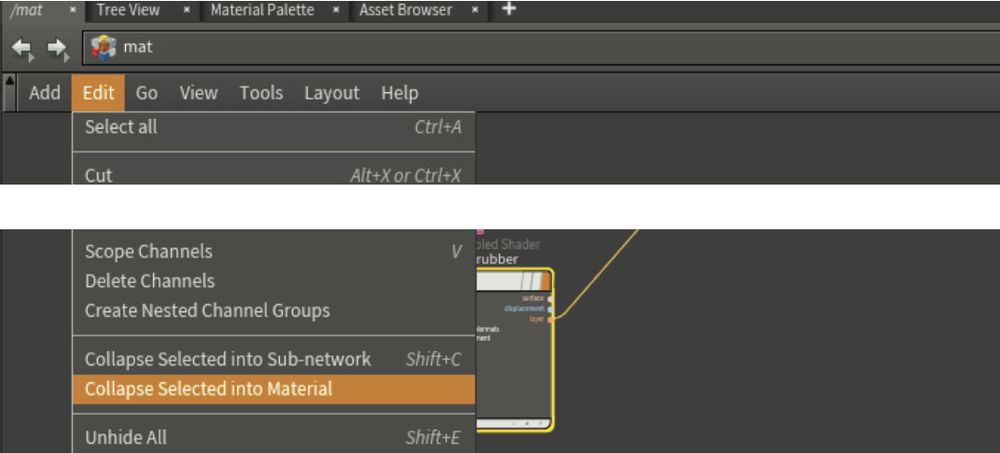
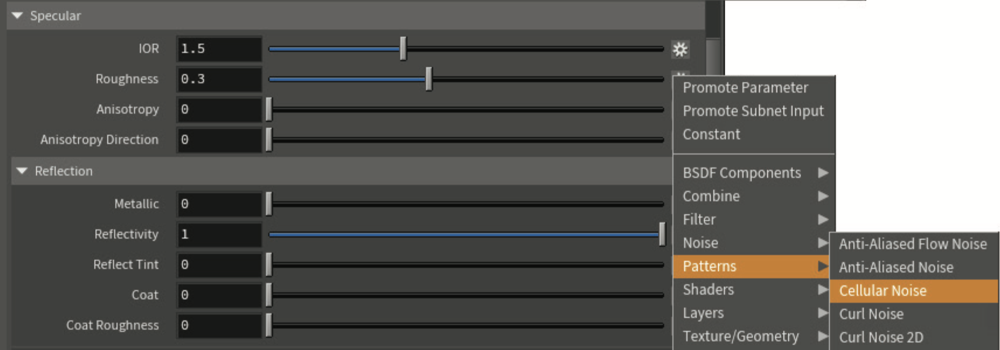
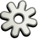
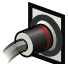
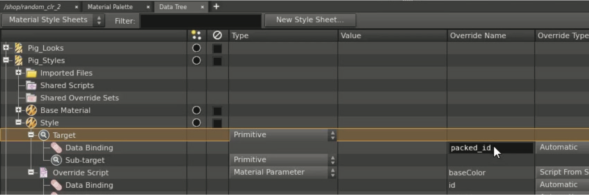
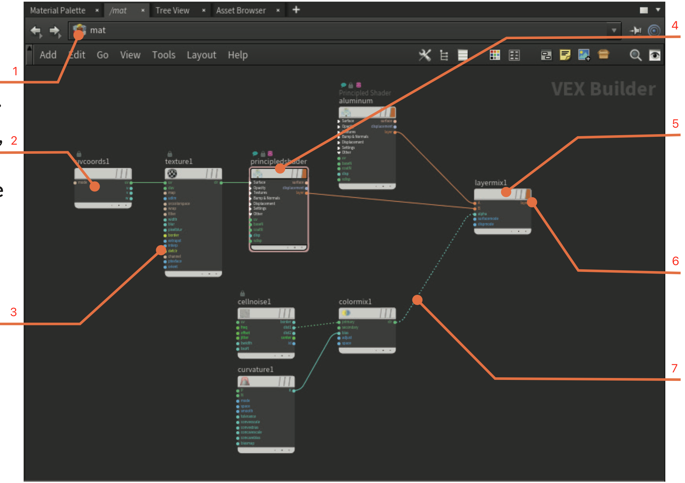

=============================================================
LookDev:着色器和材质（LookDev: Shaders & Materials）
=============================================================

若要渲染场景中的对象，必须将材质（也称为着色器）指定给几何体。在Houdini中，这些材质和着色器是在mat/vex生成器网络中创建的。在定义快照外观时，使用节点构建材质的功能是一个强大的工具。

Houdini将不同类型的节点组织为网络类型，对于材质，您将使用/mat网络类型。这是你可以为Karma 和 Mantra设置 **VEX操作符（VEX operators）** 或为Karma设置 **Material X** 的地方。Material X是一个开放标准，起源于卢卡斯影业®，用于在应用程序和渲染器之间传输外观开发内容。

~~~~~~~~~~~~~~~~~~~~~~~~~~~~~~~~~~~~~~~~~~~~~~~~~~~~~~~~~~
材质选项卡（THE MATERIAL PALETTE）
~~~~~~~~~~~~~~~~~~~~~~~~~~~~~~~~~~~~~~~~~~~~~~~~~~~~~~~~~~

可以使用“ **材质选项卡（Material Palette）** ”添加基于VEX的材质，然后通过单击和拖动将其指定给对象。此窗格有一个用于管理场景中材质的工作空间，该工作空间被组织到表示不同子网络的选项卡中，例如 **材质库LOPS（Material Library LOPS）**。使用tab键可以将 **Material X** 着色器添加到材质网络中。一旦它们就位，它们将显示在“材质选项卡”中。

~~~~~~~~~~~~~~~~~~~~~~~~~~~~~~~~~~~~~~~~~~~~~~~~~~~~~~~~~~
在LOPS中指定材质
~~~~~~~~~~~~~~~~~~~~~~~~~~~~~~~~~~~~~~~~~~~~~~~~~~~~~~~~~~

要在Solaris LOP上下文中指定材质，请首先创建一个包含/mat网络的材质库LOP。可以使用此节点指定材质，也可以稍后在链中使用“指定材质LOP”。“材质选项卡”将允许您从库拖动到库，或者在LOPS中，您可以使用箭头按钮访问场景图中的材质列表。

~~~~~~~~~~~~~~~~~~~~~~~~~~~~~~~~~~~~~~~~~~~~~~~~~~~~~~~~~~
原理着色器（Principled Shader）
~~~~~~~~~~~~~~~~~~~~~~~~~~~~~~~~~~~~~~~~~~~~~~~~~~~~~~~~~~

在“材质选项卡”中，您将找到着色器，

根据Brent Burley的Houdini“原则性”BRDF制作的材料。该着色器是“原则性的”，而不是物理的，以便让创作者更容易使用。

Principled Shader经过预构建，可以将纹理直接指定给基础颜色、凹凸、法线、位移等参数。指定的纹理贴图将显示在视口中，您可以直接实现各种外观。

你可以通过添加其他VOP来扩展这种材料，但这并不是所有情况下都必须的。库中的许多材质都是该着色器的变体。

~~~~~~~~~~~~~~~~~~~~~~~~~~~~~~~~~~~~~~~~~~~~~~~~~~~~~~~~~~
原理着色器核心（PRINCIPLED SHADER CORE）
~~~~~~~~~~~~~~~~~~~~~~~~~~~~~~~~~~~~~~~~~~~~~~~~~~~~~~~~~~

“原理着色器核心”节点位于“原理着色器”内部，包含着色模型的主要功能，但没有内置所有纹理功能。

若要使用此节点从头开始构建强大的着色器，您需要使用Houdini的着色器构建工具添加VOP节点。可以通过在“节点”视图中将节点连接在一起或使用“着色器FX（Shader FX）”菜单添加节点来完成此操作

~~~~~~~~~~~~~~~~~~~~~~~~~~~~~~~~~~~~~~~~~~~~~~~~~~~~~~~~~~
材质选项卡介绍（MATERIAL PALETTE）
~~~~~~~~~~~~~~~~~~~~~~~~~~~~~~~~~~~~~~~~~~~~~~~~~~~~~~~~~~

1. 库中的材质（Material in Gallery） --- 此处列出的材质将保存到库文件中的磁盘中。可以将这些拖动到右侧的场景区域或视口中的对象上。
#. 场景中的材质（Material in Scene） --- 在这里可以找到属于场景文件的材质。通过从此处拖动到视口中，可以将它们指定给对象。
#. 材料库LOP（Material Library LOP） --- 在LOP上下文中设置的材料可以放置到材料库中-您可以从库中将材料拖动到此处。
#. 更新材料图标（Update Material Icon）--- 要更新所有材料图标，您可以单击此按钮或右键单击材料，一次更新一个。
#. 指定材质（Assign Material）--- 如果选择场景中的对象和调色板中的材质，则可以使用此按钮指定材质。
#. 双击以编辑（Double Click to Edit）--- 如果双击这些材质中的任何一种，则会跳转到节点视图，在该视图中可以在/mat级别进行编辑。

~~~~~~~~~~~~~~~~~~~~~~~~~~~~~~~~~~~~~~~~~~~~~~~~~~~~~~~~~~
分层材质（LAYERING MATERIALS）
~~~~~~~~~~~~~~~~~~~~~~~~~~~~~~~~~~~~~~~~~~~~~~~~~~~~~~~~~~

可以对材质进行分层，为对象创建独特的外观。使用“层混合（Layer Mix）”节点，可以将两种不同的材质组合为一个外观。例如，可以使用这种技术将有光泽的金属材料和无光泽的铁锈材料分层。然后可以对alpha通道进行纹理处理，并可以选择混合曲面、置换或两者。

~~~~~~~~~~~~~~~~~~~~~~~~~~~~~~~~~~~~~~~~~~~~~~~~~~~~~~~~~~
材质构建（MATERIALS BUILDER）
~~~~~~~~~~~~~~~~~~~~~~~~~~~~~~~~~~~~~~~~~~~~~~~~~~~~~~~~~~

如果要将分层节点转化为新材质，则可以选择它们，然后选择“Edit > Collapse Selected into Material”。这将节点放在材质生成器中，您可以在其中继续调整它。在这个级别上，有输出和收集节点，以使网络高效工作。

~~~~~~~~~~~~~~~~~~~~~~~~~~~~~~~~~~~~~~~~~~~~~~~~~~~~~~~~~~
作为数字资产的材质（MATERIALS AS DIGITAL ASSETS）
~~~~~~~~~~~~~~~~~~~~~~~~~~~~~~~~~~~~~~~~~~~~~~~~~~~~~~~~~~

通过将材质保存为Houdini数字资产，可以使其更加高效。在“资源属性”面板中，可以转到“保存”选项卡并选择“保存缓存代码”，以便在使用Mantra渲染时预编译材质。也可以将纹理贴图加载到数字资源中，然后从资源文件内部引用它们。将材质转化为HDA可以更容易地与您的团队共享。

~~~~~~~~~~~~~~~~~~~~~~~~~~~~~~~~~~~~~~~~~~~~~~~~~~~~~~~~~~
着色器FX菜单（SHADER FX MENU）
~~~~~~~~~~~~~~~~~~~~~~~~~~~~~~~~~~~~~~~~~~~~~~~~~~~~~~~~~~

使用材质VOP时，可以在“网络”视图中添加节点并将它们连接在一起，也可以通过单击每个参数在最右边的图标来使用“着色器FX菜单”。通过此菜单，您可以专注于要使用的参数，并在上下文中创建节点。

在“参数面板”中，您可以通过查看最右侧的图标来查看每个参数的连接类型：

- 未连接（No Connection）
  

- 参数节点（Parameter Node）

- 连接到其它节点（Connected with other Nodes）

- 隐藏链接（Hidden Connection）

~~~~~~~~~~~~~~~~~~~~~~~~~~~~~~~~~~~~~~~~~~~~~~~~~~~~~~~~~~
程序性材料分配（PROCEDURAL MATERIAL ASSIGNMENT）
~~~~~~~~~~~~~~~~~~~~~~~~~~~~~~~~~~~~~~~~~~~~~~~~~~~~~~~~~~

在生产中使用大量数据时，通常有必要采用程序化方法来分配材料。使用Solaris和Karma，可以使用“指定材质LOP（Assign Material LOP）”或“材质变体LOP（Material Variation LOP）”等节点来完成此操作。

如果使用的是Mantra，则可以使用“数据树（Data Tree）”面板将材质指定给对象，该面板允许您访问“材质”样式表（Material stylesheets）。样式表允许您使用规则将材质和纹理指定给大型对象组。

~~~~~~~~~~~~~~~~~~~~~~~~~~~~~~~~~~~~~~~~~~~~~~~~~~~~~~~~~~
着色器构建（SHADER BUILDING）
~~~~~~~~~~~~~~~~~~~~~~~~~~~~~~~~~~~~~~~~~~~~~~~~~~~~~~~~~~

1. 节点路径（Node Path） --- 这将确认您的当前路径，并帮助您导航进出材料网络。
2. VOP节点（VOP Nodes） --- 在材质上下文中，可以从材质节点开始，然后连接VOP节点以自定义材质的纹理。完成后，可以选择将所有这些折叠回材质生成器节点中。
3. 节点连接器（Node Connectors） --- 可以使用Shader FX菜单将节点添加到此区域，中键单击该点即可访问该菜单。右键点击这个点可以得到一个完整的节点菜单。
4. 原理材质（Principled Material） --- 这是一种典型的材质，可以单独分配或加入层混合物中。
5. 层混合（Layer Mix） --- 材质上的层输出可以输入到此混合节点。可以将其指定给几何体。
6. 材质标志（Material Flag） --- 如果希望层混合显示在材质选项板中，请选中此标志。
7. Alpha --- 在这里，层混合节点的Alpha由VOP节点提供，以创建两层材料的Alpha遮罩。

