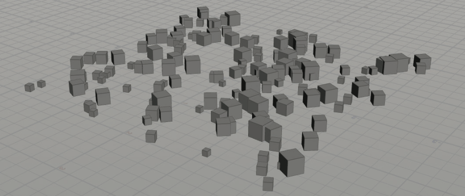
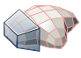

===============================================
建模工具
===============================================

Houdini有很多工具来创建、塑造和变形几何体，以获得所需的外观。以下是在Houdini的几何体或SOP上下文中构建模型时经常使用的许多工具中的一些。

~~~~~~~~~~~~~~~~~~~~~~~~~~~~~~~~~~~~~~~~~~~~~~~~~~~~~~~~~~
创建（CREATION）
~~~~~~~~~~~~~~~~~~~~~~~~~~~~~~~~~~~~~~~~~~~~~~~~~~~~~~~~~~

要开始创建几何体，可以从一些基本形状开始或绘制曲线。在每种情况下，都会得到一个对象，其中包含一个几何体/SOP节点和工具名称。您可以在“创建”工具架或放射状菜单中访问这些。

.. image:: ../../_static/images/icon/creation-primitives.png
    :alt: 基本体
    :align: left
    :width: 23px

- 基本体（Primitives）--- Houdini包括长方体、球体、管状和圆环体基本体形状以及各种柏拉图实体。

- 网格（Grid）--- 网格工具为各种模型提供了一个很好的起点。可以在几何图形级别设置其形状和大小。

- 曲线（Curve）--- 通过放置控制点绘制曲线，然后创建Bezier、NURBS或多边形曲线。

~~~~~~~~~~~~~~~~~~~~~~~~~~~~~~~~~~~~~~~~~~~~~~~~~~~~~~~~~~
多边形建模（POLYGON MODELING）
~~~~~~~~~~~~~~~~~~~~~~~~~~~~~~~~~~~~~~~~~~~~~~~~~~~~~~~~~~

多边形是最流行的几何体类型之一，尤其是在电子游戏项目中，多边形是强制性的。Houdini有一套全面的多边形建模工具，您可以使用这些工具来开发您的模型。

- 多边形绘制（PolyDraw） --- 使用此工具可以在构建平面上交互式绘制多边形网格，或通过捕捉到现有几何体。

.. image:: ../../_static/images/icon/polygon-modeling-polyextrude.png
    :alt: 多边形挤出
    :align: left
    :width: 23px

- 多边形挤出（PolyExtrude） --- 推动或拉动一个或多个多边形以重塑几何体。控制拉伸轮廓以获得各种各样的形状。

    .. image:: ../../_static/images/poly-extrude.png
        :alt: 多边形挤出

- 多边形倒角（PolyBevel） --- 对选定的边进行倒角以创建倒角或圆角倒角。通常可以使用前一个节点（如Polyextrude或Boolean）的输出组来自动查找右边。

- 多边形桥（PolyBridge） --- 连接两组多边形，并控制桥的形状。
  
    .. image:: ../../_static/images/poly-bridge.png
        :alt: 多边形桥

.. image:: ../../_static/images/icon/polygon-modeling-polysplit.png
    :alt: 多边分割
    :align: left
    :width: 23px

- 多边形分割/循环边/刀（PolySplit/Edge Loop/Knife）--- 使用这些工具可以分割多边形，为模型添加更多细节。

- 多边形二维展开（PolyExtend 2D）--- 获取位于二维平面上的曲线和边，并基于所需的偏移值创建几何体。

- 多边形减少（PolyReduce）---- 通过减少多边形数量同时保留四边形和UV来创建不同级别的细节。

- 点焊接（PointWeld）--- 以交互方式将点组捕捉到另一个目标点，并合并它们。

~~~~~~~~~~~~~~~~~~~~~~~~~~~~~~~~~~~~~~~~~~~~~~~~~~~~~~~~~~
工具节点（UTILITY NODES）
~~~~~~~~~~~~~~~~~~~~~~~~~~~~~~~~~~~~~~~~~~~~~~~~~~~~~~~~~~

由于Houdini的程序性，复制、剪辑和镜像等建模操作会在网络中创建节点。这可以使以后更容易地返回并进行更改。

- 剪裁（Clip）--- 基于剪裁平面剪裁模型。可以设置片段的方向，以及是否保留一半、另一半或两者。

- 镜像（Mirror）--- 此工具基于剪裁平面翻转几何体。镜像后可以选择融合点。

- 复制和变换（Copy and Transform）--- 此节点将允许您根据变换值创建多个副本。

- 爆炸（Blast）--- 此节点用于从模型中删除多边形。可以选择移除或保留选定的多边形。如果在选择点或多边形时按Delete键，它们将被爆破。

- 溶解（Dissolve）--- 使用此工具可以在不破坏周围几何体的情况下删除边。选择边时按Delete键将使其溶解。

~~~~~~~~~~~~~~~~~~~~~~~~~~~~~~~~~~~~~~~~~~~~~~~~~~~~~~~~~~
细分曲面建模（SUBDIVISION SURFACE MODELING）
~~~~~~~~~~~~~~~~~~~~~~~~~~~~~~~~~~~~~~~~~~~~~~~~~~~~~~~~~~

在Houdini中，可以使用多边形建模，然后使用对象参数窗格上“渲染(Render)”选项卡上的选项将其显示并渲染为细分曲面。也可以在几何体级别创建“细分(Subdivide)”节点以添加多边形，从而为您提供更详细的拓扑结构。

~~~~~~~~~~~~~~~~~~~~~~~~~~~~~~~~~~~~~~~~~~~~~~~~~~~~~~~~~~
表面处理工具（SURFACING TOOLS）
~~~~~~~~~~~~~~~~~~~~~~~~~~~~~~~~~~~~~~~~~~~~~~~~~~~~~~~~~~

Houdini中有一些工具可以获取轮廓曲线并构建曲面。这些输入曲线可以是贝塞尔曲线、多边形曲线或NURBS曲线，也可以是它们的混合曲线。

- 旋转（Revolve）--- 通过围绕轴旋转轮廓曲线来创建几何体。有一个可用于调整结果的句柄。

- 蒙皮（Skin）--- 获取一系列轮廓曲线并将其转化为曲面。

- 轨道（Rails）--- 沿两条或多条轨道曲线复制一条或多个轮廓曲线，然后对结果进行蒙皮以获得曲面。

.. image:: ../../_static/images/surfacing-tools.png
    :alt: 表面处理工具

~~~~~~~~~~~~~~~~~~~~~~~~~~~~~~~~~~~~~~~~~~~~~~~~~~~~~~~~~~
布尔工具（BOOLEANS）
~~~~~~~~~~~~~~~~~~~~~~~~~~~~~~~~~~~~~~~~~~~~~~~~~~~~~~~~~~

使用布尔工具减去、合并或求交几何图形。该节点可以处理非常复杂的拓扑结构，并可用于使用刚体动力学分解曲面以进行破坏。与基于Voronoi的Shatter节点相比，这通常会创建更逼真的结果。

~~~~~~~~~~~~~~~~~~~~~~~~~~~~~~~~~~~~~~~~~~~~~~~~~~~~~~~~~~
使工具变形（DEFORM TOOLS）
~~~~~~~~~~~~~~~~~~~~~~~~~~~~~~~~~~~~~~~~~~~~~~~~~~~~~~~~~~

虽然可以通过直接编辑点来塑造几何图形，但有时需要更通用的方法。以下节点提供了按程序塑造几何体的选项。

- 弯曲（Bend）--- 使用此节点可以设置捕捉范围和方向，然后弯曲、扭曲、锥化和挤压包含的几何体。
  
    .. image:: ../../_static/images/deform-tools.png
        :alt: 弯曲

- 晶格（Lattice）--- 这将围绕几何体构建晶格，然后允许您编辑框架上的点以重塑其形状。您也可以使用自定义框架。

.. image:: ../../_static/images/icon/deform-tools-mountain.png
    :alt: 山
    :align: left
    :width: 20px

- 山（Mountain）--- 应用噪波函数使曲面变形以创建随机结果。这些点实际上是随此节点一起移动的。

- 波纹（Ripple）--- 此节点在几何体中创建波纹形状。

- 波浪（Waves）--- 此节点添加噪波函数，以创建随时间设置动画的波浪状图案。非常适合创建逼真的海洋。

~~~~~~~~~~~~~~~~~~~~~~~~~~~~~~~~~~~~~~~~~~~~~~~~~~~~~~~~~~
复制到点+分散对齐（COPY TO POINTS + SCATTER & ALIGN）
~~~~~~~~~~~~~~~~~~~~~~~~~~~~~~~~~~~~~~~~~~~~~~~~~~~~~~~~~~

典型的Houdini工作流程是分散并对齐曲面上的点，然后复制到点。然后可以应用用于缩放和旋转对象的属性来创建更有机的结果。这通常用于用树木和岩石创造景观。

~~~~~~~~~~~~~~~~~~~~~~~~~~~~~~~~~~~~~~~~~~~~~~~~~~~~~~~~~~
拓扑构造（TOPOBUILD）
~~~~~~~~~~~~~~~~~~~~~~~~~~~~~~~~~~~~~~~~~~~~~~~~~~~~~~~~~~

Houdini有一个Topobuild节点，可以将多边形直接绘制到高分辨率几何体上，这些几何体是您扫描或在应用程序（如Pixologic的Z-Brush）中创建的。可以为动画创建更干净的拓扑，然后将原始模型中的细节烘焙到法线贴图中。

~~~~~~~~~~~~~~~~~~~~~~~~~~~~~~~~~~~~~~~~~~~~~~~~~~~~~~~~~~
体积（volumes）
~~~~~~~~~~~~~~~~~~~~~~~~~~~~~~~~~~~~~~~~~~~~~~~~~~~~~~~~~~

| volume(体积)由voxel（体积元素）组成就像polygon（面）是由point（点）组成；
| volume primitive是houdini里特有的，有点过时。最好使用vdb。

体积（Volumes）允许您在空间中存储体素或三维像素的值。当使用动态工具或创建云时，这些工具通常用于支持碰撞。它们也可以用于建模，将多个形状组合成一个体积，然后将其转换回曲面。

.. image:: ../../_static/images/volumes.png
    :alt: 体积

