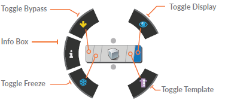
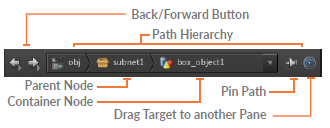
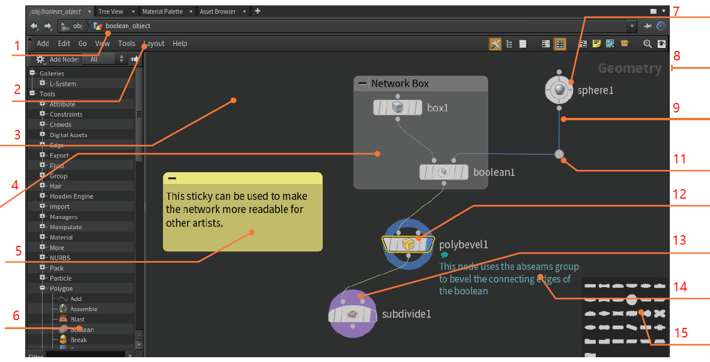
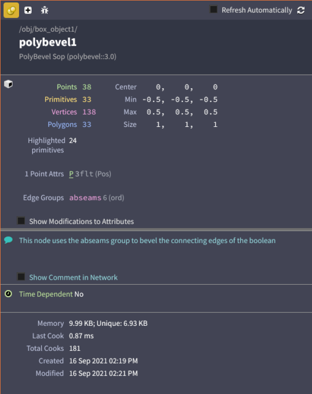

===============================================
节点与网络
===============================================

| 由于 Houdini 基于节点的工作流程是其程序架构的核心，因此了解这些节点和网络协同的的能力对于有效使用它变得非常重要。 虽然节点的想法听起来很技术性，但它们实际上对创作者非常友好且易用。

当您在 Houdini 中使用工具时，会创建节点并与其他节点连接。 由此产生的网络提供了您的历史操作记录，同时提供了一种简单的方法来进行更改和完善您的工作。 学习如何有效地使用节点网络是使用 Houdini 的重要组成部分。

~~~~~~~~~~~~~~~~~~~~~~~~~~~~~~~~~~~~~~~~~~~~~~
节点标识（NODE FLAGS）
~~~~~~~~~~~~~~~~~~~~~~~~~~~~~~~~~~~~~~~~~~~~~~

| 每个节点都有各种标志来确定它是显示、锁定还是绕过（bypassed）。 您可以通过单击标志本身或使用径向节点菜单来调用它们。

- **显示/渲染标识（Toggle Display）**  
  
  * **渲染标志（Display Flags） [R]** 该标志允许您选择网络的 **显示** 输出节点，并以空心环突出显示。 **[Alt+单击]**  仅显示显示节点；
  * **渲染标志（Render Flags）  [T]** 设置将输出哪个节点进行渲染，并用实心圆圈突出显示。 **[Ctrl+单击]** 仅显示渲染节点；
  
- **模板标志 （Template Flag）[E] ？** - 此标志以灰色显示节点，可用于参考或捕捉。

- **冻结标志（Freeze Flag）？** - 此缓存在锁定节点处，并且当网络烹饪时，链中较早的所有节点都将被忽略。

- **旁路标志 （Bypass Flag）[B] ？** - 该标志允许您在网络烹饪时忽略该节点。

~~~~~~~~~~~~~~~~~~~~~~~~~~~~~~~~~~~~~~~~~~~~~~
连接和断开节点
~~~~~~~~~~~~~~~~~~~~~~~~~~~~~~~~~~~~~~~~~~~~~~

| 当您在网络面板中工作时，节点通常会自动放置并连接在一起。 当您想要重新配置网络的设置方式时，您将需要手动连接和断开节点。

以下是与“网络”面板中的节点和连接进行交互的一些方法：

- 连接单个节点（Connect Node）--- 左键从输出拖到输入
- 串联多个节点（Connect Nodes）--- 按住J,左键穿过所需要串联的节点
- 插入新节点（Insert New Node） ---在输出上右键创建
- 插入节点（Insert Node） ---左键拖拽连接线
- 断开连接线（Disconnect from Wires）--- LMB select then Jiggle node(s)
- 剪断多个连接线（Cut Wire） ---按住Y,鼠标左键穿过所需断开的连接线
- 移动节点（Move node） --- 左键拖拽
- 复制选中节点(Copy selected nodes) --- [Alt+左键拖拽]
- 复制副本，与源节点存在关联引用（Reference Copy） --- [Alt + Shift + Ctrl + 左键]

点节点可用于组织您的网络：

- 添加点节点（Add Dot） --- 选中连接线后，[Alt+左键]
- 固定/取消固定点（Pin/Unpin Dot） --- 选中点，[Alt+左键]

~~~~~~~~~~~~~~~~~~~~~~~~~~~~~~~~~~~~~~~~~~~~~~
节点库（NODE GALLERIES）
~~~~~~~~~~~~~~~~~~~~~~~~~~~~~~~~~~~~~~~~~~~~~~

这个库提供对要直接添加到网络的节点的快速访问。 包含日常工作中最常用的节点，而 Tab 键可让您访问所有可用节点。

您可以使用“Windows”>“Gallery Manager”创建自己的库，并且可以通过用鼠标右键单击节点然后选择“Save to Gallery...”来将项目添加到您的库中。

只要为 Mat 网络中保存的节点指定了正确的关键字（例如 Mantra for Mantra 材料），它们也将在材质面板中可用。

~~~~~~~~~~~~~~~~~~~~~~~~~~~~~~~~~~~~~~~~~~~~~~
网络类型（NETWORK TYPES）
~~~~~~~~~~~~~~~~~~~~~~~~~~~~~~~~~~~~~~~~~~~~~~

Houdini 包含不同类型的节点，每个节点都在自己的上下文中工作。 网络类型标记在网络视图的右上角。 每种类型的节点都可以连接到其他网络。 虽然不同类型的节点在连接方式上相似，但它们各自具有独特的功能：

- 场景（Scene） --- 对象 --- OBJ
- 几何（Geometry） --- 曲面运算操作 --- SOP
- Solaris --- 照明/布局操作 --- LOP
- 材料（Materials） --- VEX Builder ---- MAT
- Motion FX --- 通道操作 --- CHOP
- VEX --- VEX Builder --- VOP
- 输出（Outputs） --- 渲染操作 --- ROP
- 任务（Tasks） --- 任务操作 --- TOP
- 动力学（Dynamics） --- 动态算子 --- DOP
- 合成（Compositing） --- 合成操作 --- COP/IMG

当您使用 Houdini 时，您将开始学习如何使用这种“秘密（secret”）”语言来讨论节点类型以及它们如何应用于程序工作。

~~~~~~~~~~~~~~~~~~~~~~~~~~~~~~~~~~~~~~~~~~~~~~
网络路径（NETWORK PATHS）
~~~~~~~~~~~~~~~~~~~~~~~~~~~~~~~~~~~~~~~~~~~~~~

节点按层次结构组织，一些节点嵌套在其它节点中，称为网络管理器或子网络。为了帮助您管理这些层次结构，大多数面板的顶部都提供了类似浏览器的路径

使用此路径可以在层次结构中上下导航或导航到其它网络。 默认情况下，当您在场景视图中进行选择时，路径会发生变化，尽管您可以固定路径以使其保持焦点。 您还可以将目标图标拖动到固定面板以同步它们的路径。

~~~~~~~~~~~~~~~~~~~~~~~~~~~~~~~~~~~~~~~~~~~~~~
网络导航（NAVIGATING NETWORKS）
~~~~~~~~~~~~~~~~~~~~~~~~~~~~~~~~~~~~~~~~~~~~~~

要在网络类型之间跳转，您可以采取多种不同的方法。 其中一些在您处理场景视图中的对象时会自然发生，而另一些则提供快捷方式，使您可以更快地工作。

- **选择模式（Selection Modes）** - 当您在场景视图中进行选择时，网络编辑器会跳转到选择的位置。 当您进行选择时，不同的选择模式将依次将您带到不同的网络类型。
- **网络路径（Network path）** - 您可以左键单击父节点以导航回路径，或者左键单击容器节点以访问并行节点或深入了解其他容器节点的内容。
- **径向菜单（Radial menu）** - 按 n 获取径向菜单，可让您向上、向下导航以及导航到不同的网络类型。

- **快捷键（Hotkeys）** - 这些可帮助您在处理选定对象时上下导航。
  
  * 进入节点内部（Dive in） --- I
  * 退出节点内部（Jump up） --- U
  * 切换对象/几何体（Toggle Objects/Geometry） --- F8
  * 切换上一个或下一个网络（Previous or Next Network） --- Alt + ←，Alt + →
  
- **快速标记（Quick Marks）** - 这些可让您快速设置并返回网络位置。 您可以根据需要使用它们，然后覆盖它们或忘记它们。 它们不与场景文件一起保存。
  
  * 设置快速标记（Set a Quickmark） --- Ctrl + 1, 2, 3, 4 or 5
  * 返回快速标记（Return to a Quickmark） --- 1, 2, 3, 4 or 5
  * 返回上一视图（Go Back to Previous View） --- `

~~~~~~~~~~~~~~~~~~~~~~~~~~~~~~~~~~~~~~~~~~~~~~
选择和查看的快捷键（SELECT AND VIEW HOTKEYS）
~~~~~~~~~~~~~~~~~~~~~~~~~~~~~~~~~~~~~~~~~~~~~~

在网络面板中，您需要平移和缩放才能使用完整的网络。 以下是这些操作的组合键。

- 平移（Pan） --- 拖放鼠标中键
- 缩放（Zoom） --- 拖放右键
- 框选节点（Select Nodes） --- 拖放左键
- 多选节点 Add to Selection --- Shift + 左键
- 多选后移除某个节点选中状态（Remove from Selection） --- Ctrl + 左键

~~~~~~~~~~~~~~~~~~~~~~~~~~~~~~~~~~~~~~~~~~~~~~
网络视图
~~~~~~~~~~~~~~~~~~~~~~~~~~~~~~~~~~~~~~~~~~~~~~

1. **网络路径（Network Path）** --- 通向当前网络级别的路径。 您还可以使用此栏导航到其他网络。 
#. **面板菜单（Pane menu）** --- 这些菜单和图标用于组织您的网络。
#. **网络背景（Network Background）** --- 使用面板菜单添加图像或设置网格来帮助您组织节点。
#. **网络盒子（Network Box）** --- 对相关节点进行分组，然后快速折叠和展开它们。
#. **便笺（Sticky note）** --- 添加注释以帮助其他创作者阅读您的网络或为他们的网络提供想法
#. **节点库（Node Gallery）** --- 将节点从此处拖动到您的网络。 使用底部的过滤器找到您需要的节点。
#. **节点（node）？** --- 对于它的展现操作，影响了最终的网路输出结果
#. **网络类型（Network Type）** --- 显示您正在使用的网络类型。
#. **连接器（Connector）** - 连接线显示节点如何链接在一起以及数据如何通过网络传输。
#. **点（Dot）** - 您可以添加点连接器以更轻松地组织节点。
#. **显示环（Display Ring）** - 这个小圆圈显示场景视图中显示的节点。
#. **评论（Comments）** - 可以显示节点评论以帮助其他创作者理解您的想法。
#. **调色板（Palettes）** - 菜单上的按钮显示调色板，可让您设置节点的颜色和形状。

~~~~~~~~~~~~~~~~~~~~~~~~~~~~~~~~~~~~~~~~~~~~~~
了解您的节点
~~~~~~~~~~~~~~~~~~~~~~~~~~~~~~~~~~~~~~~~~~~~~~

使用径向菜单或在节点上按住鼠标中键调出信息框。 该面板为您提供有关节点内容、组、属性和其他重要事实的信息。 此面板还突出显示干扰您的工作流程的任何错误。 

该面板将自动关闭，但您可以单击“固定（Pin）”图标以使其在工作时保持可见。 您可以使用此面板添加注释并在网络视图中显示它们。

