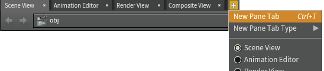
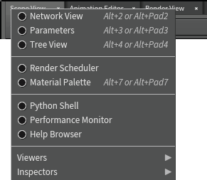
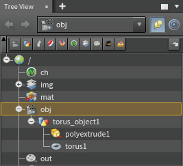
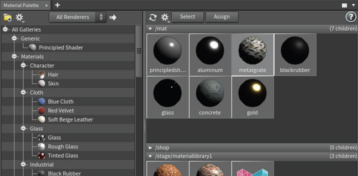
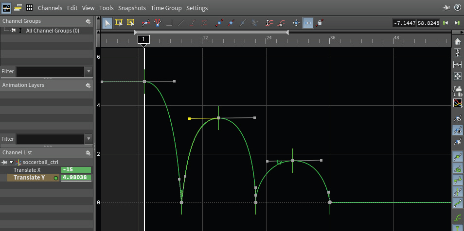
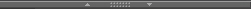
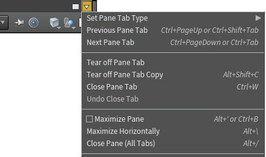
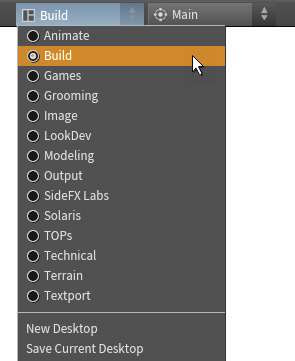
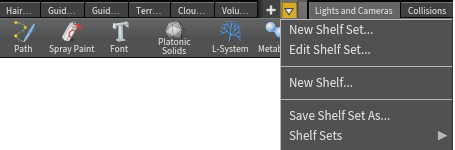
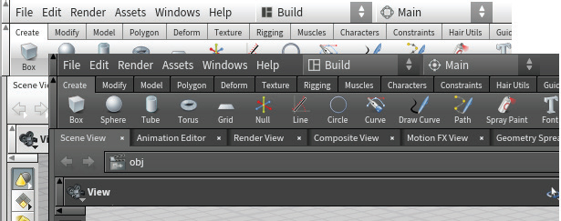

===============================================
面板和桌面
===============================================

Houdini 工作区分为多个面板，提供了组织场景数据的独特方式。 您可以在 3D 视图中进行交互工作或在电子表格中分析属性值。 了解如何使用这些不同的 UI 元素来完成工作非常重要。

~~~~~~~~~~~~~~~~~~~~~~~~~~~~~~~~~~~~~~~~~~~~~~~~~~~~~~~~~~
面板及选项卡
~~~~~~~~~~~~~~~~~~~~~~~~~~~~~~~~~~~~~~~~~~~~~~~~~~~~~~~~~~

Houdini 工作区分为多个面板，以便您可以设置和探索场景。 面板选项卡允许您重叠同一区域内的多个面板以方便使用，但默认情况下不可见。

您可以通过在工作区中单击面板选项卡来访问它。

您可以通过单击 x 将其关闭。 + 菜单可用于更改您正在查看的面板或添加新面板。

~~~~~~~~~~~~~~~~~~~~~~~~~~~~~~~~~~~~~~~~~~~~~~~~~~~~~~~~~~
面板类型
~~~~~~~~~~~~~~~~~~~~~~~~~~~~~~~~~~~~~~~~~~~~~~~~~~~~~~~~~~

在面板选项卡上单击鼠标右键可更改其类型。 有多种窗格类型可供选择。 以下是其中一些有热键的。 这里列出了其他一些。 请参阅文档以了解有关所有其他内容的更多信息。

------------

- **网络视图 [Alt-2]** - 此视图可让您查看节点和网络并连接、重新连线和重新组织它们以满足您的需求。
- **参数 [Alt-3]** - 设置参数值、添加表达式并控制节点的属性。
- **树视图 [Alt-4]** - 这是节点的分层视图。 这是理解场景层次结构如何工作的好方法。
  

------------

- **查看器（Views） > 场景视图（Scene View） [Alt-1]** - 在 3D 空间中交互工作。 这种类型的视图可以设置一个或多个视口。 您可以同时打开多个场景视图面板，以便从不同的角度查看场景
- **合成视图（Composite View） [Alt-0]** - 查看使用合成 [COP] 节点创建的图像和合成图像。
- **运动 FX 视图（Motion FX View） [Alt-^]** - 这使您可以查看使用 Houdini 通道运算符 [CHOP] 节点创建的运动。

------------

- **Solaris > 场景图（Scene Graph）** - 此面板显示使用 Solaris [LOP] 节点时的 USD 场景图。
- **Solaris > 渲染库（Render Gallery）** - 此窗格允许您保存测试渲染，然后在查看所有图像后恢复到每个图像的设置。
- **Solaris > 光链接器（Light Linker）** - 连接灯光和对象。

------------

- **渲染调度程序（Render Scheduler）** - 此面板向您显示已完成和正在进行的渲染。您可以在此处暂停和终止渲染。
- **材质调色板 （Material Palette）[Alt-7]** - 此调色板可让您查看场景中的所有材质，并选择它们并将其分配给对象和几何体。

-------------

- **动画（Animation） > 动画编辑器（Animation Editor）[Alt-6]** - 管理关键帧和动画曲线。 该编辑器还具有表格和摄影表视图。

- **动画 > 通道列表（Channel List）** - 在 Houdini 中制作动画时创建通道组并管理范围通道。
- **动画 > 自动装备（Autorigs）** - 此窗格使您可以访问使用两足动物、四足动物和面部装备模块构建自己的装备的工具。
- **动画 > 角色选取器（Character Picker）** - 您可以使用此窗格更轻松地选择角色装备的部分。

-------------

- **检查器（Inspectors） > 几何电子表格（Geometry Spreadsheet） [Alt-8]** - 几何上的属性值的视图。 这可能包括 UV、法线或您自己设置的自定义值。
- **检查器（Inspectors） > 数据树（Data Tree）** - 此视图使您可以访问灯库、材质样式表和对象外观列表。

-------------

- **Mantra 渲染（Mantra Rendering） > 渲染视图（Render View） [Alt-9]** - 启动交互式 Mantra 渲染，当您更改场景中的某些内容时，该渲染将会更新。
- **Mantra 渲染（Mantra Rendering）** > 镜头列表（Take List） - 此列表可让您通过更改特定参数来探索不同的“镜头”。 然后，您可以管理镜头以专注于您喜欢的创意选择。

-------------

- **TOPS > 任务图表** - 任务图表显示图表中所有工作项或特定节点中所有工作项的元数据。

-------------

- **杂项 > Orbolt 资产浏览器** - 此浏览器可让您访问 Orbolt.com 的资产。 要使用此窗格，您需要使用 orbolt.com 帐户登录。
- **杂项 > 文本端口** - 您可以使用此窗格键入命令。
- **杂项 > Python Shell** - 您可以使用此窗格键入 Python 命令。

-------------

~~~~~~~~~~~~~~~~~~~~~~~~~~~~~~~~~~~~~~~~~~~~~~~~~~~~~~~~~~
组织和折叠面板
~~~~~~~~~~~~~~~~~~~~~~~~~~~~~~~~~~~~~~~~~~~~~~~~~~~~~~~~~~

面板和工具栏都可以通过单击 UI 中的箭头来折叠和展开。 整个窗格可以向左或向右折叠，您可以使用中心手柄翻转内容。 这些选项使您可以通过单击鼠标隐藏其他窗格来专注于某些窗格。

~~~~~~~~~~~~~~~~~~~~~~~~~~~~~~~~~~~~~~~~~~~~~~~~~~~~~~~~~~
面板菜单（PANE MENU）
~~~~~~~~~~~~~~~~~~~~~~~~~~~~~~~~~~~~~~~~~~~~~~~~~~~~~~~~~~

每个面板的左上角都有一个用于最大化和最小化的按钮，以及一个可让您访问 **面板菜单** 的箭头。 通过此菜单，您可以抛出面板（独立于软件主窗口的面板，tear off）或面板的副本、关闭或拆分面板。 您还可以选择确定每个面板的 UI。

~~~~~~~~~~~~~~~~~~~~~~~~~~~~~~~~~~~~~~~~~~~~~~~~~~~~~~~~~~
桌面（DESKTOP）
~~~~~~~~~~~~~~~~~~~~~~~~~~~~~~~~~~~~~~~~~~~~~~~~~~~~~~~~~~

当您打开选项卡、添加分隔线并组织面板选项卡时，您就开始设置自己的工作区。 要保存任何布局，请转至桌面菜单（OSX 上的 Windows > 桌面），您可以在其中访问已保存的桌面、保存您自己的桌面并在工作时管理它们。 当您保存桌面时，它将保存面板布局、径向菜单和可见的货架组。

当您保存场景时，它会记住您正在查看的桌面，但不会在工作时对窗格布局进行任何更改。 除非您明确将它们保存到桌面或创建新桌面，否则这些更改将消失。

~~~~~~~~~~~~~~~~~~~~~~~~~~~~~~~~~~~~~~~~~~~~~~~~~~~~~~~~~~
货架和货架组（SHELVES AND SHELF SETS）
~~~~~~~~~~~~~~~~~~~~~~~~~~~~~~~~~~~~~~~~~~~~~~~~~~~~~~~~~~

要管理工作区顶部的货架，请访问箭头图标下的菜单。 您可以使用它来处理货架组。 您还可以调出可能隐藏在桌面中的货架组。

~~~~~~~~~~~~~~~~~~~~~~~~~~~~~~~~~~~~~~~~~~~~~~~~~~~~~~~~~~
颜色设置（COLOR SETTINGS）
~~~~~~~~~~~~~~~~~~~~~~~~~~~~~~~~~~~~~~~~~~~~~~~~~~~~~~~~~~

您可以通过为工作区选择配色方案来自定义 Houdini UI 的外观。 选择“编辑”>“颜色设置”以打开选项窗口，然后您可以从默认的 Houdini Dark 或 Houdini Light 中进行选择。 单击“下载”按钮，从 Houdini 社区创建的配色方案列表中进行选择。

