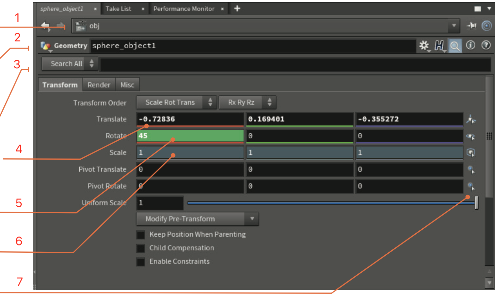

===============================================
参数、通道、属性
===============================================

Houdini 中的所有节点均由参数、通道和属性驱动，以帮助您实现所需的结果。 Houdini 中使用的术语可能与其他 3D 应用程序不同，因此最好花点时间在 Houdini 环境中理解它们。

~~~~~~~~~~~~~~~~~~~~~~~~~~~~~~~~~~~~~~~~~~~~~~~
参数（PARAMETERS）
~~~~~~~~~~~~~~~~~~~~~~~~~~~~~~~~~~~~~~~~~~~~~~~

参数是指 Houdini 节点上的值、滑块、按钮和复选框。 这些有时在其他应用程序中称为属性，但 Houdini 以不同的方式使用属性。

您可以在“参数”面板中或使用视口中的手柄来更改参数值。 每个参数上都有一个右键菜单，为您提供许多重要选项，例如复制、粘贴和恢复默认值。

~~~~~~~~~~~~~~~~~~~~~~~~~~~~~~~~~~~~~~~~~~~~~~~
查找参数（SEARCHING PARAMETERS）
~~~~~~~~~~~~~~~~~~~~~~~~~~~~~~~~~~~~~~~~~~~~~~~

一个节点可能有大量参数，对它们进行排序可能需要时间。 如果单击右上角的放大镜，您会看到一个搜索栏，可让您根据名称和内容过滤参数。 你可以找到使用表达式、重写后甚至原始值的参数。

~~~~~~~~~~~~~~~~~~~~~~~~~~~~~~~~~~~~~~~~~~~~~~~
管道与关键帧（CHANNELS | KEYFRAMES）
~~~~~~~~~~~~~~~~~~~~~~~~~~~~~~~~~~~~~~~~~~~~~~~

您可以通过按 Alt 键并用鼠标左键单击名称或值字段来设置参数的关键帧。 设置关键帧后，参数字段的颜色就会改变，并且创建一个动画通道。 您可以在动画编辑器中访问这些与参数关联的关键帧。

~~~~~~~~~~~~~~~~~~~~~~~~~~~~~~~~~~~~~~~~~~~~~~~
管道与表达式（CHANNELS | EXPRESSIONS）
~~~~~~~~~~~~~~~~~~~~~~~~~~~~~~~~~~~~~~~~~~~~~~~

您可以使用 hScript 或 Python 将表达式添加到参数中，而不是原始值。 参数面板右上角有一个菜单，用于选择要使用的语言。 您可以按 Ctrl+E 调出带有许多脚本工具的表达式编辑器，用以更轻松地完成编辑工作。

~~~~~~~~~~~~~~~~~~~~~~~~~~~~~~~~~~~~~~~~~~~~~~~
引用场景数据（REFERENCE SCENE DATA）
~~~~~~~~~~~~~~~~~~~~~~~~~~~~~~~~~~~~~~~~~~~~~~~

您还可以用鼠标右键单击参数并选择“引用（Reference）”>“场景数据（Scene Data）” 以打开一个窗口，用于专门选择要链接的内容。 从场景中的任何节点做出选择后，即可创建通道引用。 通过此方法，您可以创建引用，而不必担心编写正确表达式所需的确切语法。

~~~~~~~~~~~~~~~~~~~~~~~~~~~~~~~~~~~~~~~~~~~~~~~
参数面板（Parameter Pane）
~~~~~~~~~~~~~~~~~~~~~~~~~~~~~~~~~~~~~~~~~~~~~~~

1. **导航栏（Navigation Bar）** - 此栏可让您查看节点在场景层次结构中的位置。 
#. **节点类型和名称（Node Type and Name）** - 在这里您可以查看节点类型并设置其名称。 单击该图标会出现一个用于使用该节点的菜单。
#. **搜索栏（Search Bar）** - 单击放大镜图标可按名称或内容搜索参数。
#. **更改的参数（Changed Parameter）** - 当参数的默认值发生更改时，其值会以粗体显示。 文件夹选项卡名称也以粗体显示。
#. **动画参数（Animated Parameter）** - 当您对参数设置关键帧时，它会以绿色突出显示。
#. **锁定参数（Locked Parameter）** - 您可以用鼠标右键单击参数来锁定和解锁它。 它将以灰色突出显示
#. **选择匹配（Select to Match）** - 这些图标可让您将这些参数值与其他对象进行匹配。

~~~~~~~~~~~~~~~~~~~~~~~~~~~~~~~~~~~~~~~~~~~~~~~
自定义参数（CUSTOM PARAMETERS）
~~~~~~~~~~~~~~~~~~~~~~~~~~~~~~~~~~~~~~~~~~~~~~~

如果单击“参数”面板右上角的齿轮图标，则可以选择“编辑参数界面”。 您可以在此处添加自定义参数，然后将其链接到节点网络的其他部分。

~~~~~~~~~~~~~~~~~~~~~~~~~~~~~~~~~~~~~~~~~~~~~~~
属性（ATTRIBUTES）
~~~~~~~~~~~~~~~~~~~~~~~~~~~~~~~~~~~~~~~~~~~~~~~

属性允许您将数据附加到几何图形，链上的节点可以使用这些数据来完成操作。 燃料属性可以驱动 Pyro FX 模拟，或者 UV 属性设置纹理。 某些属性是由 Houdini 节点创建的，或者您可以创建自定义属性。

- **类（Class）** - 属性可以属于点、基元、细节和顶点。 这将影响它们在整个链条中的使用方式。
- **类型（Type）** - 您可以设置浮点型、整数型或字符串型等属性类型。

~~~~~~~~~~~~~~~~~~~~~~~~~~~~~~~~~~~~~~~~~~~~~~~
属性随机化（ATTRIBUTE RANDOMIZE）
~~~~~~~~~~~~~~~~~~~~~~~~~~~~~~~~~~~~~~~~~~~~~~~

属性随机化允许您创建属性并立即随机化其值。 例如，在这里您可以看到这些框的颜色、旋转和比例是随机的。

~~~~~~~~~~~~~~~~~~~~~~~~~~~~~~~~~~~~~~~~~~~~~~~
属性转移（ATTRIBUTE TRANSFER）
~~~~~~~~~~~~~~~~~~~~~~~~~~~~~~~~~~~~~~~~~~~~~~~

在节点链中，属性附加到几何图形，然后由其他节点使用。 您还可以使用 **属性转移** 将属性传递给其他几何体。 这里，球体根据定义的阈值将颜色属性传递给盒子

~~~~~~~~~~~~~~~~~~~~~~~~~~~~~~~~~~~~~~~~~~~~~~~
Attribute Wrangle 节点
~~~~~~~~~~~~~~~~~~~~~~~~~~~~~~~~~~~~~~~~~~~~~~~

Houdini 有各种各样的节点，可让您创建和使用属性。 您还可以使用 Attribute Wrangle 节点来使用基于脚本的方法来完成此工作。 对于很多技术人员来说，这可能是最舒适的工作方式。

.. image:: ../../_static/images/attribute-wrangle.png
    :alt: Attribute Wrangle节点

对于创作者来说，使用节点可以更轻松地处理此类信息。 Houdini 的很多功能都体现在正确使用属性中，您最终需要了解它们。

~~~~~~~~~~~~~~~~~~~~~~~~~~~~~~~~~~~~~~~~~~~~~~~
几何电子表格（GEOMETRY SPREADSHEET）
~~~~~~~~~~~~~~~~~~~~~~~~~~~~~~~~~~~~~~~~~~~~~~~

您可以使用几何电子表格查看所有属性值，甚至是不可见的属性值。

1. 导航栏（Navigation Bar） - 此栏可让您查看节点在场景层次结构中的位置。
#. 节点名称（Node Name） - 这显示当前选择了哪个节点以及哪个节点正在生成这些属性值。
#. 属性类按钮（Attribute Class Buttons） - 使用这些按钮来过滤您正在查看的属性类型。
#. 点编号（Point Number） - 以下是几何点编号，可帮助您确定属性在模型上的位置。
#. 属性值（Attribute Values） - 这些是节点网络链中此时的值。
#. 过滤器（Filter） - 当您使用大量参数时，您可以在此处键入参数名称来过滤列表。

