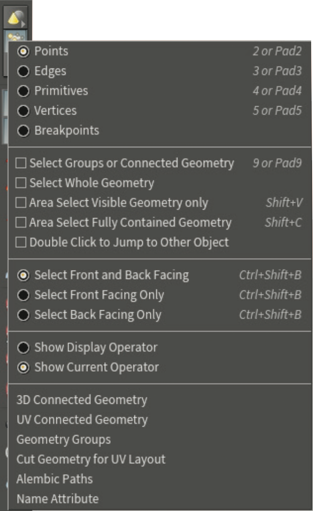

===============================================
选择几何体（Selecting Geometry）
===============================================

| 在 Houdini 中工作涉及许多不同元素的选择和操作。 有许多工具和选项可帮助您有效地处理对象和几何组件，例如点、边和基原（最小元素）。

~~~~~~~~~~~~~~~~~~~~~~~~~~~~~~~~~~~~~~~~~~~~~~~
选择工具 (SELECT TOOL)
~~~~~~~~~~~~~~~~~~~~~~~~~~~~~~~~~~~~~~~~~~~~~~~

选择工具可让您专注于进行选择，因此它没有任何操作手柄。

选择 --- Tap S

当使用“移动”或“旋转”等工具并且“安全选择”处于打开状态时，您需要调用“选择”工具来进行选择。 将“安全选择”切换为“关闭”以自由选择。

在其他工具中调用选择工具 ------ 按住 S

切换安全选择 ------ ~

~~~~~~~~~~~~~~~~~~~~~~~~~~~~~~~~~~~~~~~~~~~~~~~
选择类型 (SELECTION TYPES)
~~~~~~~~~~~~~~~~~~~~~~~~~~~~~~~~~~~~~~~~~~~~~~~

有不同的快捷方式可用于添加、减去或切换您的选择以及选择全部或不选择。 这些技术在此工作流程中发挥着重要作用

- 选择（Select）--- 左键
- 添加到选择（Add to Selection）--- Shift + 左键
- 从选择中删除（Remove from Selection）--- Ctrl[Cmd] + 左键
- 切换选择（Toggle Selection）---  Ctrl[Cmd] + Shift + 左键
- 选择全部（Select All）--- A [Object Level] / N [Geometry Level]
- 选择无（Select None）--- A [Object Level] / N [Geometry Level] N [Object Level] / Shift + N [Geometry Level]

~~~~~~~~~~~~~~~~~~~~~~~~~~~~~~~~~~~~~~~~~~~~~~~
选择技巧（SELECTION TECHNIQUES）
~~~~~~~~~~~~~~~~~~~~~~~~~~~~~~~~~~~~~~~~~~~~~~~

在视口中，您可以从四种不同的选择类型中进行选择，这些类型提供了访问几何体的不同方式。

- 框选（Box Select）------ F2

- 套索选择（Lasso Select）------ F3

.. image:: ../../_static/images/icon/brush-select.png
    :alt: 画笔选择
    :width: 22px
    :align: left

- 画笔选择（Brush Select）------ F4

- 激光选择（Laser Select）------ F5

还有一些选择过滤器可让您专注于可见几何体或选择组。 您有多种选择选项，可以帮助您在工作时变得更加轻松。

- 仅选择可见几何图形（Select Visible Geometry Only）------ Shift + V

- 仅选择完全包含的几何图形（Select Fully Contained Geometry Only）------ Shift + C

- 选择组或连接的几何图形（Select Groups or Connected Geometry）------ 9

- 选择整个几何图形（Select Whole Geometry）------ 在操作控制栏中选择

- 按法线选择（Select by Normals）------ 在操作控制栏中选择

~~~~~~~~~~~~~~~~~~~~~~~~~~~~~~~~~~~~~~~~~~~~~~~
选择模式（SELECTION MODES）
~~~~~~~~~~~~~~~~~~~~~~~~~~~~~~~~~~~~~~~~~~~~~~~

| 选择模式，让您可以访问对象和组件。 它们还允许您使用工具栏中的按钮或快捷键轻松地从对象级别跳转到几何级别。

**对象模式（Objects）** - 对象网络级别是您处理对象变换的地方。 在 **视图（View）** 工具以外的任何工具中，以下热键将使您返回到对象级别：

对象（Objects）------ 1

**几何模式（Geometry）** - 当不在 **视图（View）** 中时，您可以使用以下任何热键跳转到几何级别，并选择可供选择的组件。

点（Points）------ 21212111

边（Edges）------ 3

基元、最小的元素、面（primitives）------ 4

顶点（Vertices）------ 5

~~~~~~~~~~~~~~~~~~~~~~~~~~~~~~~~~~~~~~~~~~~~~~~
选择模式菜单（SELECT MODE MENUS）
~~~~~~~~~~~~~~~~~~~~~~~~~~~~~~~~~~~~~~~~~~~~~~~

每种选择模式都带有选项，可让您改变与场景的交互方式。 您可以通过 左键 或 右键 单击每种模式的图标来访问这些选项。

使用组件时，此菜单允许您选择显示 **Display** 或 **（Current）** 操作。 使用“ **编辑（Edit）** ”节点时，“场景”视图顶部也提供了这些相同的选项。

该菜单在对象级别有所不同，其中包括一些针对不同类型对象的过滤器以及更轻松地选择材料、约束和数字资产的选项。

~~~~~~~~~~~~~~~~~~~~~~~~~~~~~~~~~~~~~~~~~~~~~~~
调整模式（TWEAK MODE）
~~~~~~~~~~~~~~~~~~~~~~~~~~~~~~~~~~~~~~~~~~~~~~~

一次只能激活一种几何体选择模式。 如果您正在使用“编辑”节点，则“调整模式”可让您选择点、边和图元的任意组合。

~~~~~~~~~~~~~~~~~~~~~~~~~~~~~~~~~~~~~~~~~~~~~~~~~~~~~~
如何使用工具选择（HOW SELECTIONS ARE USED BY TOOLS）
~~~~~~~~~~~~~~~~~~~~~~~~~~~~~~~~~~~~~~~~~~~~~~~~~~~~~~

当您使用工具在视口中进行选择后，将创建一个节点，并且选定的点、基元或边会在节点的 **组（Group）** 参数中列出。

例如，在这里我们看到基元 5、6、9 和 10 正在被 Polyextrude 节点使用。 您可以看到它们列在“组”节点中，然后用于挤出面。

.. image:: ../../_static/images/how-selections-are-used-by-tools-1.png
    :alt: 如何使用工具选择

如果您要更改传入几何节点的拓扑，则可能会有更多或更少的面，并且拉伸将移动到不同的位置。 这可能不是您想要的，您可能需要重新选择面。

.. image:: ../../_static/images/how-selections-are-used-by-tools-2.png
    :alt: 如何使用工具选择

为此，您可以选择 Polyextrude，按 Enter 转到处理工具，然后按 ` 进入重新选择模式。 选择新的基元，然后按 Enter 键，您的新选择将在 **组（Group）** 参数中使用。

~~~~~~~~~~~~~~~~~~~~~~~~~~~~~~~~~~~~~~~~~~~~~~~~~~~~~~
选择全部和组字段（SELECT ALL AND THE GROUP FIELD）
~~~~~~~~~~~~~~~~~~~~~~~~~~~~~~~~~~~~~~~~~~~~~~~~~~~~~~

要选择传入几何体上的所有基元，请将 **组（Group）** 参数留空。 如果传入几何体的拓扑发生变化，则所有内容都将由该节点进行操作。

在视口中使用全选 [N] 通常可以确保在使用工具时该字段保持空白。 对于某些工具，“组”字段将显示所有选定的零件，您必须手动清除该字段以将其设为空白。

~~~~~~~~~~~~~~~~~~~~~~~~~~~~~~~~~~~~~~~~~~~~~~~~~~~~~~
组节点（THE GROUP NODES）
~~~~~~~~~~~~~~~~~~~~~~~~~~~~~~~~~~~~~~~~~~~~~~~~~~~~~~

通过组节点，您可以按名称引用已定义的点、顶点、多边形或边选择。 您可以通过在查看器中选择组件以交互方式定义组，或者使用范围或表达式以数学方式定义组。 然后可以将组名称分配给组参数，而不是使用点或原始数字。

以下是一些组节点供您选择：

- **组创建（Group Create）** - 使用交互式选择、边界框、面法线方向或边缘角度来填充组。

- **按范围分组（Group by Range）** - 这允许您选择一个范围和一个简单的模式来填充组。

- **组表达式（Group Expression）** - 通过此节点，您可以使用 vex 表达式来定义组的成员资格。

- **组绘制（Group Paint）** - 此节点允许您使用交互式绘制界面来选择组的几何图形。

~~~~~~~~~~~~~~~~~~~~~~~~~~~~~~~~~~~~~~~~~~~~~~~
选择选项（SELECTION OPTIONS）
~~~~~~~~~~~~~~~~~~~~~~~~~~~~~~~~~~~~~~~~~~~~~~~

- **编辑|组件（Edit|Components）** 您可以从这组按钮中选择要使用的组件。 这里已经选择了边缘选择。

- **选择工具（Select Tool）** - 选择工具可让您进行选择。 要访问它，请按 S 热键。

- **安全选择（Secure Selection）** - 这会在使用其他工具时锁定您的选择。 要在打开的情况下调用选择工具，请按住 S 热键。

- **选择类型（Selection Types）** - 您可以使用此顶栏来更改选择类型。 您可以选择盒子、套索、画笔或激光。 还有一些过滤器选项。

- **循环边（Edge Loop）** - 要选择循环边，您可以在选择边时双击。 要选择部分循环，请选择一条边，然后按 A，然后按结束边。 这适用于点和基元。 您还可以使用相同的技术选择点循环或原始循环。

- **着色选项（Shading Options）** - 着色选项决定您在场景视图中看到的内容。 在本例中，我们使用平滑有线着色。

- **右键菜单（RMB Menu）** - 在选择工具中，此菜单使您可以访问选择选项，例如反向选择、边界或增大和缩小选择。

- **显示过滤器（Display Filter）** - 此过滤器可让您关闭不需要的东西，例如骨骼、空对象、灯光或相机，以便您专注于手头的工作。

- **显示选项（Display Options）** - 虽然选择模式将显示边缘或点以帮助您选择，但在使用其他工具时它们将不可见。 即使不使用特定的建模工具，使用这些选项也可以使它们保持可见。

