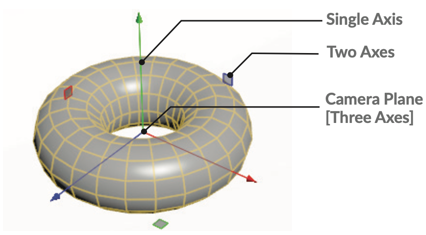

===============================================
变换和编辑（Transform & Edit）
===============================================

从对象的基本变换工具，到动画装备的姿势工具和重塑几何体的编辑节点，有许多不同的工具可以让您在视口中使用交互式的操纵杆。在Houdini中，这些操纵杆与正在使用的节点紧密相连。

~~~~~~~~~~~~~~~~~~~~~~~~~~~~~~~~~~~~~~~~~~~~~~~
变换工具（TRANSFORM TOOLS）
~~~~~~~~~~~~~~~~~~~~~~~~~~~~~~~~~~~~~~~~~~~~~~~

变换工具为您提供了可用于操纵对象或重塑几何体的途径。变换对象时，对象级别的参数会更新以反映您的更改。

- 移动（Move）------ T

- 旋转（Rotate）------ R

- 大小（Scale）------ E

.. image:: ../../_static/images/icon/transform-pose.png
    :alt: 姿势
    :width: 20px
    :align: left

- 姿势（Pose）------ Ctrl+R

- 叫操纵杆吧（Handle）------ Enter

使用“操纵杆”工具可以访问特定于选定节点的操纵杆。使用这些工具时，可以通过按住S重新选择，进行新的选择，然后释放S并继续变换。

~~~~~~~~~~~~~~~~~~~~~~~~~~~~~~~~~~~~~~~~~~~~~~~
变换操纵杆（TRANSFORM HANDLES）
~~~~~~~~~~~~~~~~~~~~~~~~~~~~~~~~~~~~~~~~~~~~~~~

使用“移动”操纵杆时，可以使用单轴、两轴或使用中心沿摄影机平面移动。旋转和缩放操纵杆提供类似的控制。

~~~~~~~~~~~~~~~~~~~~~~~~~~~~~~~~~~~~~~~~~~~~~~~
鼠标中键平移（MMB TRANSLATION）
~~~~~~~~~~~~~~~~~~~~~~~~~~~~~~~~~~~~~~~~~~~~~~~

使用“移动”操纵杆时，可以使用单轴、两轴或使用中心沿摄影机平面移动。旋转和缩放操纵杆提供类似的控制。

如果不想直接单击操纵杆，可以在开放空间中使用鼠标中键并拖动，使其沿构造平面移动。若要将其更改为沿最近的轴平移，请转到“编辑>首选项>操纵杆(Edit > Preferences > Handles)”，然后将“平移操纵杆”设定为“贴图拖动到轴(Map Drag to Axis)”。

~~~~~~~~~~~~~~~~~~~~~~~~~~~~~~~~~~~~~~~~~~~~~~~
姿势工具（POSE TOOL）
~~~~~~~~~~~~~~~~~~~~~~~~~~~~~~~~~~~~~~~~~~~~~~~

设置动画时，可以使用“姿势”工具处理骨骼并显示显示对象运动的运动路径操纵杆。然后可以使用切线操纵杆和关键帧点来修改视口中的运动。

~~~~~~~~~~~~~~~~~~~~~~~~~~~~~~~~~~~~~~~~~~~~~~~
编辑节点（EDIT NODE）
~~~~~~~~~~~~~~~~~~~~~~~~~~~~~~~~~~~~~~~~~~~~~~~

如果您尝试移动几何组件，则将放置一个 **编辑节点（Edit node）** 以接受您的转换。除了变换几何体，您还可以在曲面上滑动，垂直于法线工作或雕刻曲面

- 编辑（Edit）------ T/R/E

- 在曲面上滑动（Slide on Surface）------ L

- 尖端（Peak）------ H

.. image:: ../../_static/images/icon/edit-node-sculpt.png
    :alt: 雕刻
    :width: 23px
    :align: left

- 雕刻（Sculpt）------ B

~~~~~~~~~~~~~~~~~~~~~~~~~~~~~~~~~~~~~~~~~~~~~~~
软衰减（SOFT FALLOFF）
~~~~~~~~~~~~~~~~~~~~~~~~~~~~~~~~~~~~~~~~~~~~~~~

变换点时，可以使用“软编辑半径”创建衰减。有一个可视化工具可以向您显示曲面上发生衰减的位置。

- 峰值操纵杆(Peak Handle)
- 软编辑可视化(Soft Edit Visualizer)
- 软编辑HUD(Soft Edit HUD)

~~~~~~~~~~~~~~~~~~~~~~~~~~~~~~~~~~~~~~~~~~~~~~~
编辑选项（EDIT OPTIONS）
~~~~~~~~~~~~~~~~~~~~~~~~~~~~~~~~~~~~~~~~~~~~~~~

如果您在编辑节点(Edit node)中右键单击，则可以访问用于变换所选内容的选项。您可以制作一个圆形或拉直所选内容。这些选项适用于点和边，但并不总是适用于基元。

- 制作圆圈（Make Circle）--- Shift + C
- 均匀空间选择（Evenly Space Selection ）--- Shift + E
- 松弛选择（Relax Selection）--- Shift + R
- 拉直选择（Straighten Selection）--- Shift + S

~~~~~~~~~~~~~~~~~~~~~~~~~~~~~~~~~~~~~~~~~~~~~~~
操纵杆工具（HANDLE TOOL）
~~~~~~~~~~~~~~~~~~~~~~~~~~~~~~~~~~~~~~~~~~~~~~~

使用工具架工具后，您经常会发现自己处于“操纵杆”工具中。或者，可以在网络中选择一个节点，然后在“场景”视图中按 **Enter** 键进入操纵杆工具。这会产生一个操纵杆，该操纵杆关注所选节点的特定参数，例如polyextrude节点上的距离参数。

**显示当前操纵杆（Show Current Operator）**--- 默认情况下，当您选择显示节点以外的节点时，它将成为当前节点，并获得几何体的线框显示。然后，可以使用操纵杆来操纵此中间节点，同时在着色曲面上评估结果。

**始终显示操纵杆（Show Display Operator）**--- 另一个选项是始终显示操纵杆。在这种情况下，选择链中的节点不会显示线框，并且操纵杆会集中在显示节点上。

您可以在当前节点的参数面板中更改参数，但操纵杆将继续使用显示节点上的参数。

~~~~~~~~~~~~~~~~~~~~~~~~~~~~~~~~~~~~~~~~~~~~~~~
编辑图形（EDITING GEOMETRY）
~~~~~~~~~~~~~~~~~~~~~~~~~~~~~~~~~~~~~~~~~~~~~~~

1. 编辑|组件（Edit & Components ） --- 您可以使用这些按钮选择要编辑的零部件。此处已选择“点”选项。

#. 移动工具（Move Tool） --- 使用“移动”工具可以使用“场景视图”控制柄平移选择。

#. 移动操纵杆（Move Handle） --- 使用此操纵杆，可以使用直线沿一个轴移动，也可以使用方点沿两个轴移动。右键点击操纵杆可访问其选项。

#. 软编辑半径（Soft Edit Radius） --- 在曲面上移动点时，可以使用此半径值在移动点时创建软衰减。“软编辑半径”不适用于基元或边。

#. 着色选项（Shading Options） --- 着色选项决定您在“场景”视图中看到的内容。在这种情况下，我们使用的是“平滑连线着色”。

#. 倾斜选择（Sloppy Selection） --- 如果“编辑”节点使用“倾斜选择”，则可以同时选择三个组件按钮，这将使所有组件按钮都可用于更流畅的选择过程。

#. 右键菜单（RMB Menu） --- 此菜单允许您访问“编辑”工具选项，例如您要关注的编辑类型。此信息也可在“场景”视图的顶部栏中找到。

#. 零部件选择（Component Selection） --- 也可以使用此菜单选择零部件类型。这为您提供了与主工具栏上相同的选项。

#. 编辑选项（Edit Options） --- 可以使用此菜单，使用“生成圆”和“拉直选择”等操作来编辑零部件。

~~~~~~~~~~~~~~~~~~~~~~~~~~~~~~~~~~~~~~~~~~~~~~~
操纵杆选项（HANDLE OPTIONS）
~~~~~~~~~~~~~~~~~~~~~~~~~~~~~~~~~~~~~~~~~~~~~~~

所有操纵杆都有一个菜单，可以通过右键点击操纵杆的任何部分来访问。

此菜单为您提供了对齐操纵杆、将其从节点的参数拆离、轴模式等选项。可以使用这些选项自定义操纵杆的工作方式。

您还可以为操纵杆上的参数设置关键帧，并将操纵杆的所有部分提升为数字资产。通过提升参数，可以在资产级别访问操纵杆。

