===============================================
UV和贴图纹理（UVs & Textures）
===============================================

若要使二维贴图正确地适配到三维对象上，需要使用UV坐标来定义几何体的展平视图。当您第一次在胡迪尼中创建几何体时，它将没有任何UV。即使是基本体对象也没有任何内置UV。这意味着您需要使用一个或多个SOP节点在几何体级别添加它们。

~~~~~~~~~~~~~~~~~~~~~~~~~~~~~~~~~~~~~~~~~~~~~~~
UV纹理显示（UV TEXTURE DISPLAY）
~~~~~~~~~~~~~~~~~~~~~~~~~~~~~~~~~~~~~~~~~~~~~~~

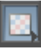

由于Houdini中的几何体默认情况下没有设置UV纹理属性，因此需要使用UV工具添加它们。设置UV后，将在几何体上看到纹理栅格，因为“显示选项”栏中已启用“显示UV纹理”。如果不想看到UV纹理或将其更改为颜色纹理，可以将其禁用。

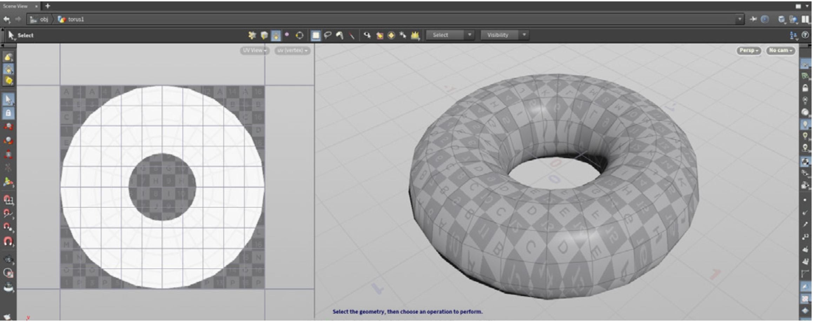

~~~~~~~~~~~~~~~~~~~~~~~~~~~~~~~~~~~~~~~~~~~~~~~
UV 项目节点（UV PROJECT）
~~~~~~~~~~~~~~~~~~~~~~~~~~~~~~~~~~~~~~~~~~~~~~~

通过该节点，可以使用几种投影技术之一指定UV。一旦选择了投影类型，就可以初始化投影以匹配对象。这可能会反转UV，并且需要将旋转x值设置为-90而不是90。在上面可以看到正交投影，在下面可以看到圆环投影。

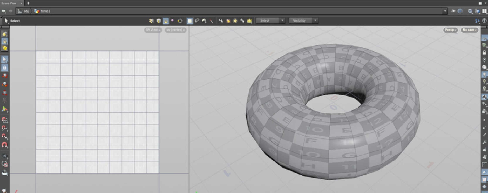

~~~~~~~~~~~~~~~~~~~~~~~~~~~~~~~~~~~~~~~~~~~~~~~
UV压平（UV Flatten）
~~~~~~~~~~~~~~~~~~~~~~~~~~~~~~~~~~~~~~~~~~~~~~~

UV压平基于使用选定边或边组创建的预定义边界来展开几何体。然后，可以通过在UV视图中固定点并调整孤岛来调整结果，以获得所需的外观。

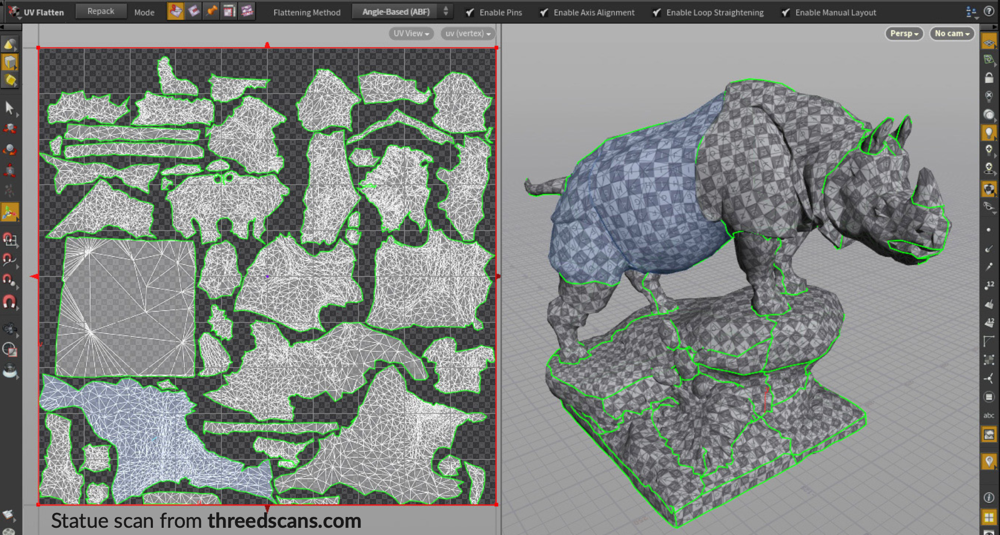

~~~~~~~~~~~~~~~~~~~~~~~~~~~~~~~~~~~~~~~~~~~~~~~
UV编辑与变形（UV EDIT & DISTORTION）
~~~~~~~~~~~~~~~~~~~~~~~~~~~~~~~~~~~~~~~~~~~~~~~

若要编辑单个顶点或顶点组，将使用UVedit或UVtransform节点。UVedit节点允许使用单个节点执行多次编辑，而UVtransform允许每个节点进行一次编辑，这可以提供更程序化的结果。可以使用“UV视口”菜单中的“Display > UV Distortion”来查看是否编辑过多。

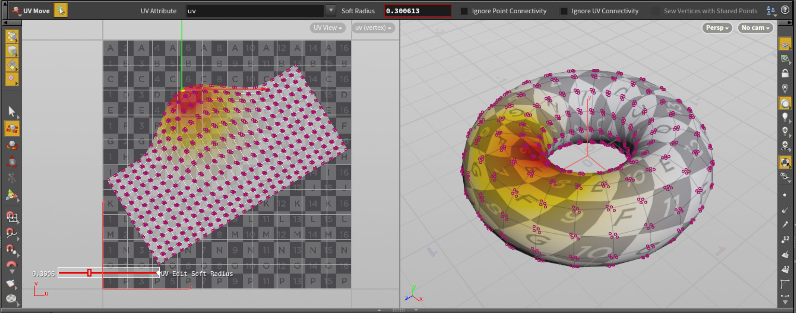

~~~~~~~~~~~~~~~~~~~~~~~~~~~~~~~~~~~~~~~~~~~~~~~
UV布局（UV Layout）
~~~~~~~~~~~~~~~~~~~~~~~~~~~~~~~~~~~~~~~~~~~~~~~

UV布局将允许您创建UV岛，并尽可能有效地将它们打包到UV空间中。这样可以最大限度地提高几何体上使用的纹理数量，这在优化渲染和游戏时非常重要。

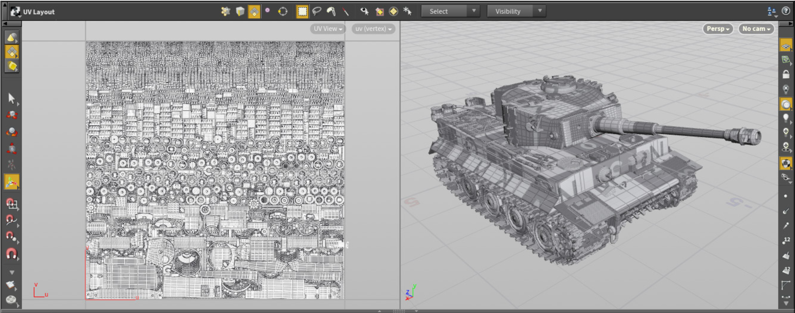

可以使用区域控制杆将UV布局放置到UV空间的特定部分。然后，后续布局可以使用“Pack Islands in Cavities”选项围绕此布局进行处理。

~~~~~~~~~~~~~~~~~~~~~~~~~~~~~~~~~~~~~~~~~~~~~~~
UDIMS
~~~~~~~~~~~~~~~~~~~~~~~~~~~~~~~~~~~~~~~~~~~~~~~

除了使用“单个UV平铺”外，还可以使用UDIM将UV分布在多个平铺上。使用此技术可以创建更详细的纹理贴图，因为UV岛不会太紧密。编号正确的纹理贴图将被指定给相应的平铺。

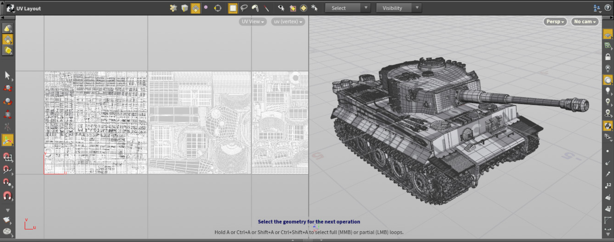

~~~~~~~~~~~~~~~~~~~~~~~~~~~~~~~~~~~~~~~~~~~~~~~
UV属性（UV ATTRIBUTES）
~~~~~~~~~~~~~~~~~~~~~~~~~~~~~~~~~~~~~~~~~~~~~~~

之前，您学习了如何将属性指定给传递重要信息的几何体。UV是顶点属性，可以将纹理贴图包裹在模型周围，也可以在网络中传播。

这些属性在UV视口中可视化，并在几何体电子表格中进行分析。这些属性可与各种SOP节点一起使用，包括允许高级TD使用脚本管理其UV的“属性争吵”节点。

~~~~~~~~~~~~~~~~~~~~~~~~~~~~~~~~~~~~~~~~~~~~~~~
UV集（UV SETS）
~~~~~~~~~~~~~~~~~~~~~~~~~~~~~~~~~~~~~~~~~~~~~~~

可以在同一几何体上创建多个UV集。使用UV节点时，可以设定UV属性。默认情况下，这是uv，但您可以创建一个uv2来创建第二个集。在VOP中指定纹理时会使用这些不同的UV集，以便不同的纹理贴图使用不同的UV属性。

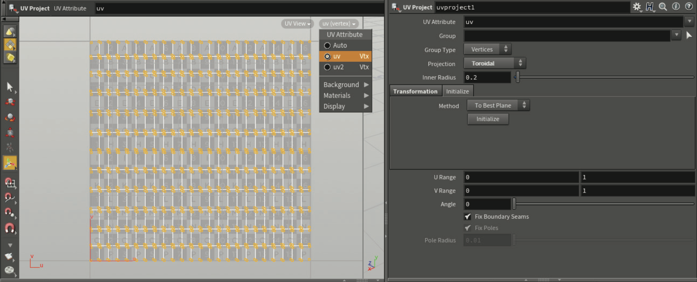

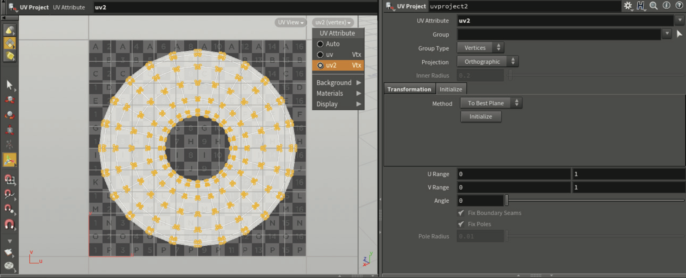

在此处显示的两个图像中，第一个使用环形投影并指定给uv UV属性，而第二个使用平面投影并指定为uv2 UV属性。这些UV属性可以有任何名称，例如，它可以是bob而不是uv2。

~~~~~~~~~~~~~~~~~~~~~~~~~~~~~~~~~~~~~~~~~~~~~~~
UV视口菜单（UV VIEWREPORT MENU）
~~~~~~~~~~~~~~~~~~~~~~~~~~~~~~~~~~~~~~~~~~~~~~~

使用UV视口菜单可以基于UV属性显示UV。也可以使用此菜单来计算背景图像，该图像可以是默认的UV栅格，也可以是从指定材质中提取的纹理贴图。

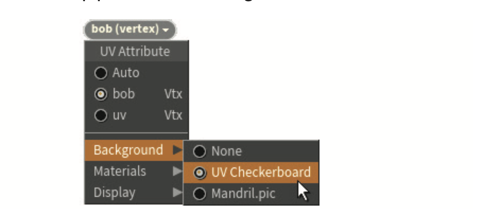

该菜单还具有用于显示“UV重叠（UV Overlap）”、“UV背面（UV Backfaces ）”和“UV扭曲（UV Distortion）”的显示选项。当评估UV以决定是否需要进行更多调整时，这些选项会很有用。

~~~~~~~~~~~~~~~~~~~~~~~~~~~~~~~~~~~~~~~~~~~~~~~
属性传递（Attribute Transfer）
~~~~~~~~~~~~~~~~~~~~~~~~~~~~~~~~~~~~~~~~~~~~~~~

可用于管理属性的SOP节点之一是“属性传递”（Attribute Transfer），通过该节点可以从一个几何体中获取UV属性，并根据与另一个几何图元的接近程度进行传递。

当模型的拓扑发生更改，但希望保留为原始模型创建UV所做的一些工作时，这可能很有用。

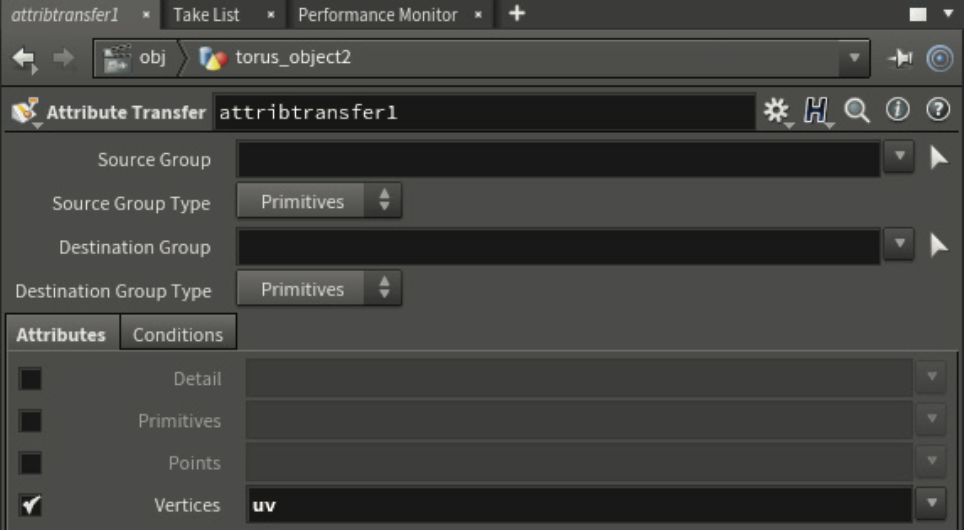

~~~~~~~~~~~~~~~~~~~~~~~~~~~~~~~~~~~~~~~~~~~~~~~
UVS视图（SCENE VIEW | UVS）
~~~~~~~~~~~~~~~~~~~~~~~~~~~~~~~~~~~~~~~~~~~~~~~
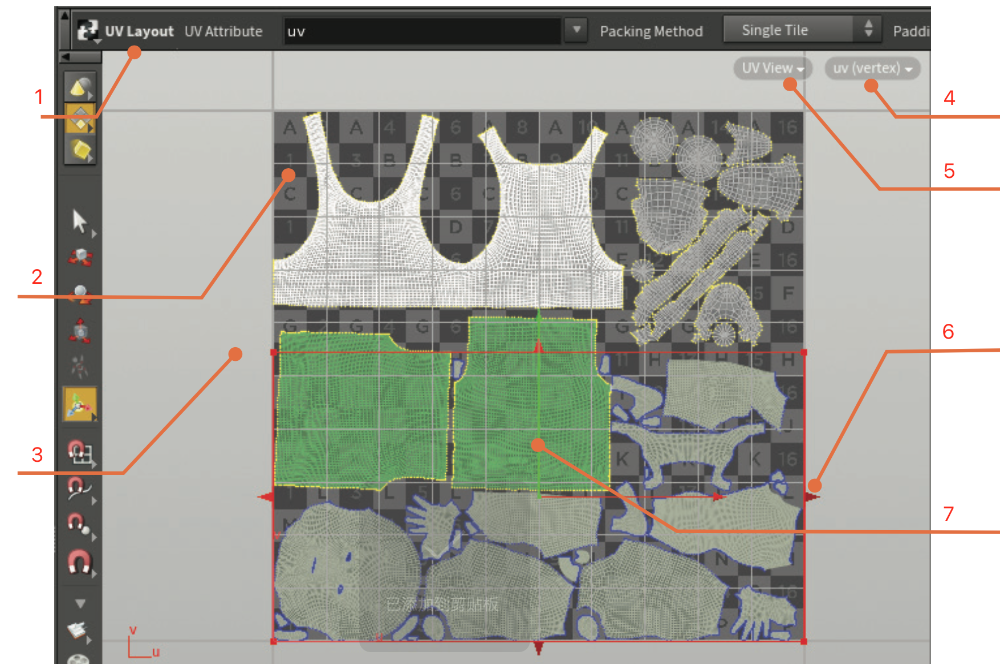

1. 当前工具(Current Tool) --- 在“场景视图”的顶部，当“控制柄”工具处于活动状态时，您将找到选定的节点。

#. 背景(Background) --- 可以使用UV菜单中的选项设置主平铺的背景。

#. 外侧主平铺(Outside Main Tile) --- 位于主平铺外部区域中的多边形将与主平铺上的相同区域重叠，因为除非使用覆盖多个平铺的UDIMS，否则纹理会重复。

#. UV菜单(UV Menu) --- 当您在UV视图中时，此菜单为您提供了许多不同的UV选项。

#. 视图菜单(View Menu) --- 使用此菜单可以为此视口选择UV视图。

#. 布局控制杆(Layout Handle) --- 此控制杆是UV布局节点的一部分，用于将UV聚焦到平铺的某个部分。

#. 打包(Pack Around) --- UV布局将围绕已设置UV的任何现有几何体打包UV。

