===============================================
工作区
===============================================

| Houdini 提供了来自其他国家的创作者所熟悉的用户界面,体验CG应用程序最大的区别在于用于管理节点和网络的窗格。 工作区是高度可配置的，可以设置为支持不同的工作方式。

Houdini 为创作者提供了多种不同的方式来查看构成 3D 场景的各个部分。 从通过相机查看几何体的 **场景视图** 到管理程序节点和网络的 **网络视图** ，您会发现许多不同的方法来做出创造性决策，同时确保每个镜头在技术层面上都有效。

~~~~~~~~~~~~~~~~~~~~~~~~~~~~~~~~~~~~~~~~~~~~~~~~~~~~~~~~~~
径向菜单（RADIAL MENUS）
~~~~~~~~~~~~~~~~~~~~~~~~~~~~~~~~~~~~~~~~~~~~~~~~~~~~~~~~~~

访问场景视图中的工具，其中一种方法是使用 **X**、 **C** 和 **V** 热键访问径向菜单。 每一个都会弹出一个放射状菜单，其中有很多选项供您选择。 每个菜单的主要重点如下

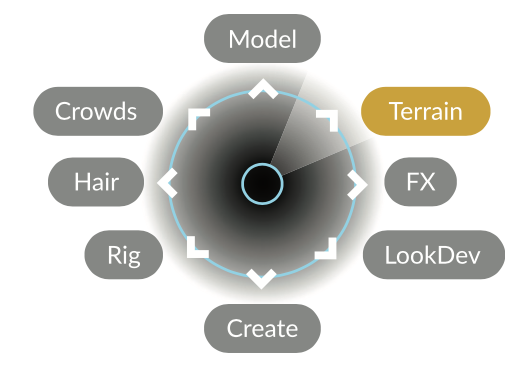

- 捕捉（Snapping） -------- X 
- Main ---------------  C 
- 视图（Views） --------------  V

一旦了解了径向菜单的工作原理及相应内容，您就可以通过快速挪动手势来访问想要的工具，而无需停留在小部件上。

您可以更改菜单栏顶部的自定义菜单，默认情况下显示“Main”。 在 OS X 上，这是径向菜单。

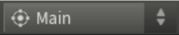

~~~~~~~~~~~~~~~~~~~~~~~~~~~~~~~~~~~~~~~~~~~~~~~~~~~~~~~~~~
就叫它货架吧（SHELF TOOLS）
~~~~~~~~~~~~~~~~~~~~~~~~~~~~~~~~~~~~~~~~~~~~~~~~~~~~~~~~~~

在工作区的顶部，您会发现多个架子，里面装满了用于创建和操作对象、几何图形、相机、灯光和效果的工具。

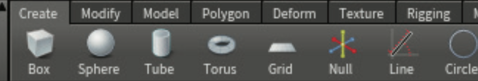

这些工具在场景视图(Scene View)中工作，并且通常涉及某种场景视图交互。 使用这些工具之一后，将创建一个或多个节点，然后您可以在 **参数（Parameter）** 和 **网络（Network）** 面板中对其进行细化。

这些货架为Houdini创作者提供了非常重要的资源，因为书架减少了点击次数，并且经常放下可供学习的节点网络。

~~~~~~~~~~~~~~~~~~~~~~~~~~~~~~~~~~~~~~~~~~~~~~~~~~~~~~~~~~
TAB菜单（TAB MENU）
~~~~~~~~~~~~~~~~~~~~~~~~~~~~~~~~~~~~~~~~~~~~~~~~~~~~~~~~~~
在 **场景视图** 或 **网络视图** 中访问工具的另一种方法是按 **Tab** 键。 这将显示您可以在工作中使用的可用工具和节点的菜单。

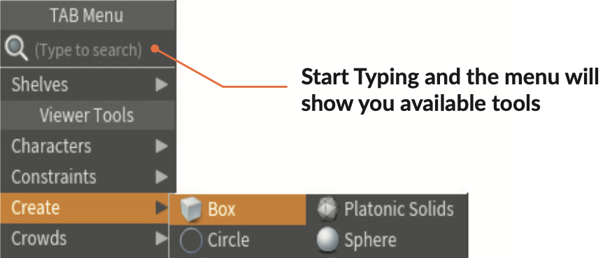

~~~~~~~~~~~~~~~~~~~~~~~~~~~~~~~~~~~~~~~~~~~~~~~~~~~~~~~~~~
3D 查看工具
~~~~~~~~~~~~~~~~~~~~~~~~~~~~~~~~~~~~~~~~~~~~~~~~~~~~~~~~~~
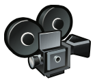

以下是查看时可用的一些快捷键。 如果您已经在查看工具中，则可以跳过空格键/alt：

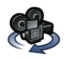

- **旋转镜头（Tumble）**  ------ 空格/alt/opt + 鼠标左键

- **上下左右平移镜头（Pan）** ------ 空格/alt/opt + 鼠标中键

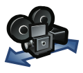

- **前后移动镜头、放大/缩小（Dolly）**  ------ 空格/alt/opt + 鼠标右键

您可以在工具栏中找到“查看(View)”工具。 当您使用空格键或 Alt 键时，您会暂时调用查看工具。 当您在视图中进行选择或操作并需要快速更改视图时，这非常有用。

如果您想专注于查看，可以按 Esc 键
转到查看工具。 这里有一些其他热键，您可以使用
获取你的方位：

- 相当于回到初始镜头角度、0.0位置为中心（Home Construction Plane） ------ 空格 + H
- 不改变镜头角度，回到初始位置（Frame All） ------ 空格 + A
- 回到初始角度，以选择元素为中心（Home Selected） ------ 空格 + G

~~~~~~~~~~~~~~~~~~~~~~~~~~~~~~~~~~~~~~~~~~~~~~~~~~~~~~~~~~
2D 平移和缩放
~~~~~~~~~~~~~~~~~~~~~~~~~~~~~~~~~~~~~~~~~~~~~~~~~~~~~~~~~~

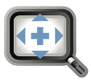

您可以单击操作控制栏中的 2D 平移和缩放工具来更改 2D 视图，而无需改变 3D 相机位置。 通过左上方的小部件，您可以单击进行平移和缩放，或者使用 Ctrl+左键 单击来重置视图。 这是处理锁定摄像机的绝佳工具。

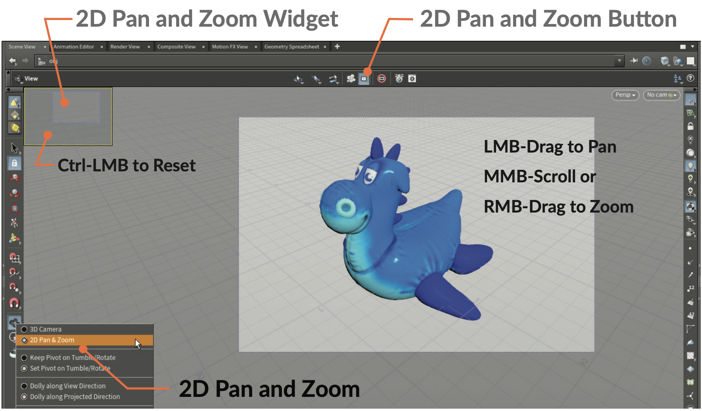

~~~~~~~~~~~~~~~~~~~~~~~~~~~~~~~~~~~~~~~~~~~~~~~~~~~~~~~~~~
第一人称相机
~~~~~~~~~~~~~~~~~~~~~~~~~~~~~~~~~~~~~~~~~~~~~~~~~~~~~~~~~~

在“查看”工具中，您可以打开类似于视频游戏中使用的第一人称飞行模式。

- 切换第一人称 开/关 ------ M 
- 前后移动 推入/推出 ------ W/S 
- 左右平移 右/左 ------ A/D 
- 环顾四周 ------ 鼠标左键

~~~~~~~~~~~~~~~~~~~~~~~~~~~~~~~~~~~~~~~~~~~~~~~~~~~~~~~~~~
视口显示菜单
~~~~~~~~~~~~~~~~~~~~~~~~~~~~~~~~~~~~~~~~~~~~~~~~~~~~~~~~~~

使用场景视图右上角的菜单或 V 径向菜单更改对象的显示方式和视图的组织方式。

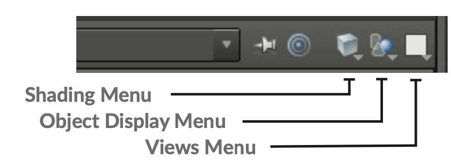

- **着色菜单(Shading Menu)** - 从线框、平面着色、平滑着色或平滑线着色等选项中进行选择。

- **对象显示菜单(Object Display Menu)** - 当您深入网络时，此菜单设置您是否隐藏、查看或查看几何图形。

- **视图菜单(Views Menu)** - 此菜单可让您将场景视图拆分为各种视图，例如透视视图或正交视图

~~~~~~~~~~~~~~~~~~~~~~~~~~~~~~~~~~~~~~~~~~~~~~~~~~~~~~~~~~
显示选项栏
~~~~~~~~~~~~~~~~~~~~~~~~~~~~~~~~~~~~~~~~~~~~~~~~~~~~~~~~~~

在场景视图的右侧，显示栏使您可以访问视口显示的选项。 这里有一些例子。

参考平面/正交网格(Reference Plane/Ortho Grid) - 打开和关闭可用于参考和网格捕捉的网格。

构造平面(Construction Plane) - 打开和关闭用于定义放置对象或点的位置的构造平面。

锁定相机(Lock Camera) - 将当前相机锁定到视图，以便视图更改可以修改相机变换值。

带阴影的高质量照明(High Quality Lighting with Shadows) - 设置视口渲染的最佳质量。

显示基原的法线(Display Primitive Normals) - 显示属于场景中所有基原的法线以确定它们的方向。基原可以理解为组成物体的最小元素；法线为垂直于面的直线；

~~~~~~~~~~~~~~~~~~~~~~~~~~~~~~~~~~~~~~~~~~~~~~~~~~~~~~~~~~
显示选项
~~~~~~~~~~~~~~~~~~~~~~~~~~~~~~~~~~~~~~~~~~~~~~~~~~~~~~~~~~

场景和网络视图都有显示选项面板，您可以通过单击显示选项栏底部的图标或使用以下热键来访问这些选项面板：

.. image:: ../../_static/images/icon/display-options.png
    :width: 25px
    :align: left

显示选项 ------ D

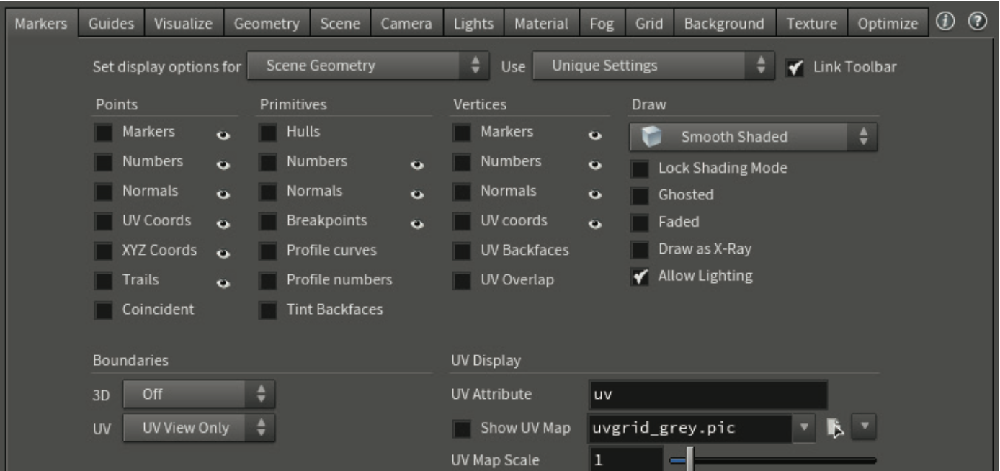

~~~~~~~~~~~~~~~~~~~~~~~~~~~~~~~~~~~~~~~~~~~~~~~~~~~~~~~~~~
工具条（TOOL BAR）
~~~~~~~~~~~~~~~~~~~~~~~~~~~~~~~~~~~~~~~~~~~~~~~~~~~~~~~~~~

a. **货架（Tool Shelf）** - 可让您在场景视图中处理对象和几何体。
#. **选择模式（Selection Modes）** - 专注于场景、几何体或动态对象。
#. **选择工具（Select Tools）** - 选择、安全选择
#. **变换工具（Transform Tools）** - 移动、旋转、缩放或姿势或用于特定于节点的控件的处理工具。
#. **捕捉工具（Snapping Tools）** - 打开网格、基元、点或多重捕捉
#. **观看（Viewing）** - 使用视图工具翻滚、平移和移动或渲染区域以在场景视图中进行渲染。 单击并按住可更改为 2D 平移和缩放。
#. **输出工具（Output Tools）** - 您可以使用这些工具渲染或快速翻动(flipbook)您的场景。

#. **视口显示菜单（Viewport Display Menus）** - 这些选项卡允许您同时创建和组织多个面板。
#. **面板选项卡（Pan Tabs）** - 这些选项卡可让您同时创建和组织多个面板。
#. **操作控制（Operation Controls）** - 使用带有此栏的处理工具来访问所选节点的参数。
#. **参数面板（Parameter Pane）** - 通过此窗格，您可以设置值、添加表达式并对所选节点设置关键帧。
#. **显示选项栏（Display Options Bar）** - 这些开关可让您控制场景显示选项，例如法线、点数或照明。
#. **场景视图（Scene View）** - 可视化您的工作并使用句柄以交互方式操作场景中的对象。
#. **网络面板（Network Pane）** - 查看和管理节点网络以处理场景的底层结构。
#. **播放栏（Playbar）** - 设置当前时间并编辑选定节点上的关键帧。 您还可以使用播放栏复制和粘贴关键帧。

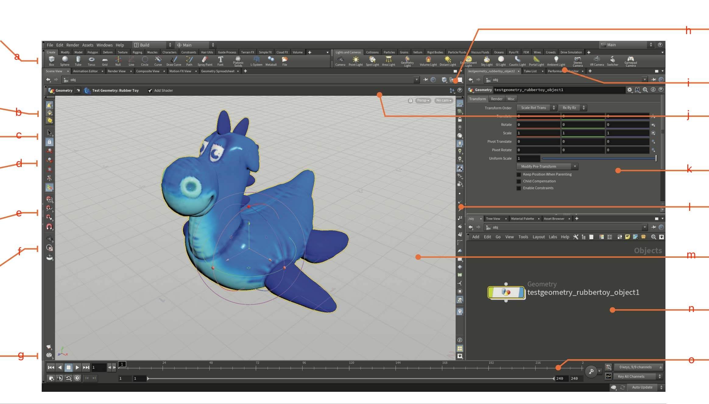